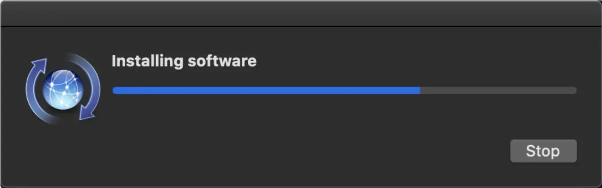

# Lab Environment Setup for Apple Silicon Machines


- [Step 1: Set Up the Host Apple Machine](#setup-host)
- [Step 2: Install VMWare Fusion Player](#install-fusion) 
- [Step 3: Create Ubuntu 22.04 VM on VMware Fusion Player](#create-vm)
- [Step 4: Install Software and Configure System](#install-software)
- [Step 5: Set Up Docker and Docker Compose](#setup-docker)


## <a id="setup-host"></a>Step 1: Set Up the Host Apple Machine

We need to install some software packages on the host Apple machine. 
To do that, we first need to install Homebrew, which
is a package manager for macOS (and Linux, too).
We assume that you already have docker 
install on your Apple machine. If you don't have it, 
please follow [these instructions](https://docs.docker.com/desktop/mac/install/).


### Step 1.1: Install Homebrew


To install Homebrew, open the terminal and run the following command.

```/bin/bash -c "$(curl -fsSL https://raw.githubusercontent.com/Homebrew/install/HEAD/install.sh)"```

If you get this error: ```xcode-select: error:
invalid developer directory '/Library/Developer/CommandLineTools'``` during the installation,
this is because your `Xcode` is not installed or set up properly,
so ```/Library/Developer/CommandLineTools``` is not a valid directory for ```xcode-select```.


You can run the following command in the terminal to further confirm that
there is no active developer directory.

```xcode-select -p```


To solve the problem, you run the following command in the terminal to 
install `xcode-select`:

```xcode-select --install```




If after installing homebrew you are not able to access brew, run the following command in the terminal.

```echo 'eval $(/opt/homebrew/bin/brew shellenv)' >> ~/.zprofile```

```eval $(/opt/homebrew/bin/brew shellenv)```


### Step 1.2: Install ```docker-mac-net-connect```

This is required to connect the docker container to the host network. 
To install `docker-mac-net-connect`, open the terminal and run the following command.

```brew install chipmk/tap/docker-mac-net-connect```

And then start the service using the following command.

```sudo brew services start chipmk/tap/docker-mac-net-connect```


## <a id="install-fusion"></a>Step 2: Install VMWare Fusion Player

VMWare Fusion Player is a free virtual machine software. 
It is similar to VirtualBox that we have been using 
for the SEED labs, but VirtualBox still cannot run 
reliably on Apple Silicon machines. 


Go to [VMware Fusion](https://customerconnect.vmware.com/en/evalcenter?p=fusion-player-personal-13) and register for a free Fusion Player license. Then under License & Download, click on `Manually Download`.


Installation is straight forward. Download the dmg file manually from the link provided in the installation page. Double click on the dmg file and follow the instructions.

After the installation is finished, you can start the VMware Fusion Player. You will be asked to enter your license key which will be there on the installation page.

After you have entered the license key, you will be asked to allow the kernel extensions. Click on `Open Security Preferences`.

In the Security & Privacy settings, click on `Allow` to allow the kernel extensions.


## <a id="create-vm"></a>Step 3: Create Ubuntu 22.04 VM on VMware Fusion Player

We are now ready to install the Ubuntu operating system.
We could not find the ARM version of Ubuntu 20.04, so we will install
Ubuntu 22.04 instead. 

We will download the Ubuntu ISO image first. 
Go to [Ubuntu 22.04.3](https://cdimage.ubuntu.com/jammy/daily-live/current/) and download the Ubuntu 22.04.3 LTS (Jammy Jellyfish) Daily Build. Make sure you download the `64-bit ARM (ARMv8/AArch64) desktop image`.


After the download is finished, start the VMware Fusion Player. Click on `Create a New Virtual Machine`.

In `Select the Installation Method`, select `Install from disc or image` and click on `Continue`.


Select `Use another disc or disc image...`, click on `Continue`, 
select the downloaded Ubuntu ISO image, and then click on `Open`.


Now click on `Continue`. In the next screen, make sure that 2 CPUs and 4 GB of RAM are selected. Click on `Finish`.


The VM will be created and started. After the VM is started, click on `Try or insall Ubuntu`.


We will be greeted with the Ubuntu home screen. 
Since we need a permanent installation for our labs, 
we will click on the `Install Ubuntu` icon.


During the installation, select `Minimal Installation` and click on `Continue`.


In the next screen, select `Erase disk and install Ubuntu` and click on `Install Now`.


Create a user with name `seed` and select a password (you can
use the standard password `dees` that we use for all SEED VMs).
Click on `Continue`.


The installation will start. After the installation is finished, click on `Restart Now`.

If this gives you an error, just remove the ISO image from the VM and restart
the VM. To do that, go to `Virtual Machine` -> `Settings` -> `CD/DVD (SATA)` and
uncheck `Connect CD/DVD Drive`. Click on `Apply` and `OK`. Now restart the VM.


Now you will be greeted with the home screen.


### Setup Bidirectional Shared Clipboard

In the default setting, the copy-and-paste does not work between your host
Apple machine and the VM running inside VMware Fusion. This is quite inconvenient. 
You can install ```vmware tools``` to set up a bidirectional shared clipboard.
Run the following commands.

```
sudo apt-get upgrade
sudo apt-get install open-vm-tools-desktop -y
sudo reboot
```

## <a id="install-software"></a>Step 4: Install Software and Configure System

We are now ready to install all the software packages needed for 
the SEED labs. 

Go to terminal, first download `curl` using

```
sudo apt-get install curl
```

Download [`src-cloud.zip`](https://seed.nyc3.cdn.digitaloceanspaces.com/src-cloud.zip)
from the link or using the following `curl` command.

  ```
  curl -o src-cloud.zip https://seed.nyc3.cdn.digitaloceanspaces.com/src-cloud.zip
  ```

In order to unzip the file, we first need to install the `unzip` program
  using the following command. After that, unzip the file.
  ```
  sudo apt update
  sudo apt -y install unzip
  unzip src-cloud.zip
  ```

After unzipping the file, you will see a `src-cloud` folder.
  Enter this folder, and run the following command to install software
  and configure the system.
  ```
  ./install.sh
  ```

- **Note:** This shell script will download and install all the software needed for
  the SEED labs. The whole process will take a few minutes. Please
  don't leave, because you will be asked twice to make choices:

  - During the installation of Wireshark, you will be asked
    whether non-superuser should be able to capture packets.
    Select `No`.

  - During the installation of `xfce4`, you will be asked to
    choose a default display manager. Choose `LightDM`.


After the script finishes, we can switch to the `seed`
account using the following command:
```
sudo su seed
```

## <a id="setup-docker"></a>Step 5: Set Up Docker and Docker Compose

After done with the setup we have to set the docker default platform to linux/arm64. Go to terminal and type the following command.

```export DOCKER_DEFAULT_PLATFORM=linux/arm64```

Docker-compose is not available for arm64 architecture. So we have to install it manually. Go to terminal and type the following commands.

```sudo curl -L "https://github.com/docker/compose/releases/download/v2.11.2/docker-compose-$(uname -s)-$(uname -m)" -o /usr/local/bin/docker-compose```

```sudo chmod +x /usr/local/bin/docker-compose```

Now you can use docker-compose in your VM.
