# Ubuntu Installation for Apple Silicon Machines

- [Step 1: Download Ubuntu server version](#download)
- [Step 2: Install Ubuntu Desktop](#install)

## Step 1: Download Ubuntu server version

Since the desktop versions of all Ubuntu VM are removed, we can no longer use the pre-built desktop versions but install the server version instead. We recommend downloading Ubuntu 22.04 version.

We will download the Ubuntu ISO image first. Go to [Ubuntu 22.04.5](https://cdimage.ubuntu.com/ubuntu/releases/22.04/release/) and download the Ubuntu 22.04.5 LTS (Jammy Jellyfish) . Make sure you download the `64-bit ARM (ARMv8/AArch64) server install image`.

After the download is finished, start the VMware Fusion Player. Click on `Create a New Virtual Machine`.

In `Select the Installation Method`, select `Install from disc or image` and click on `Continue`.

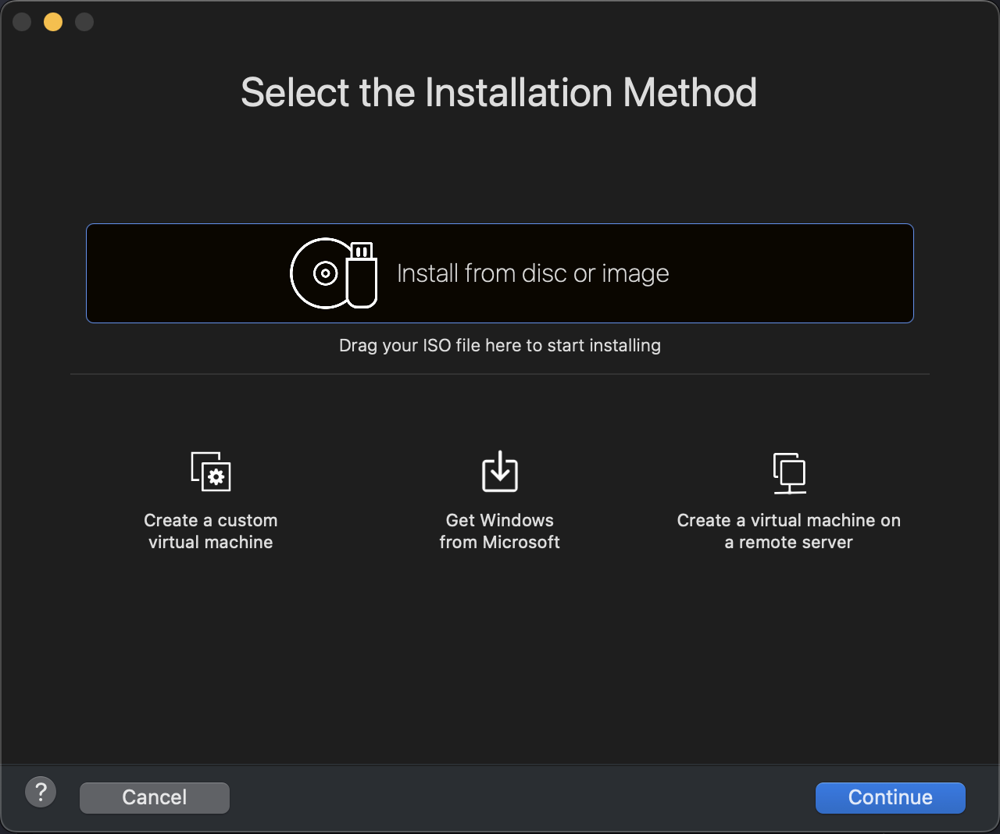

Select the downloaded Ubuntu ISO image, and then click on `Continue`.

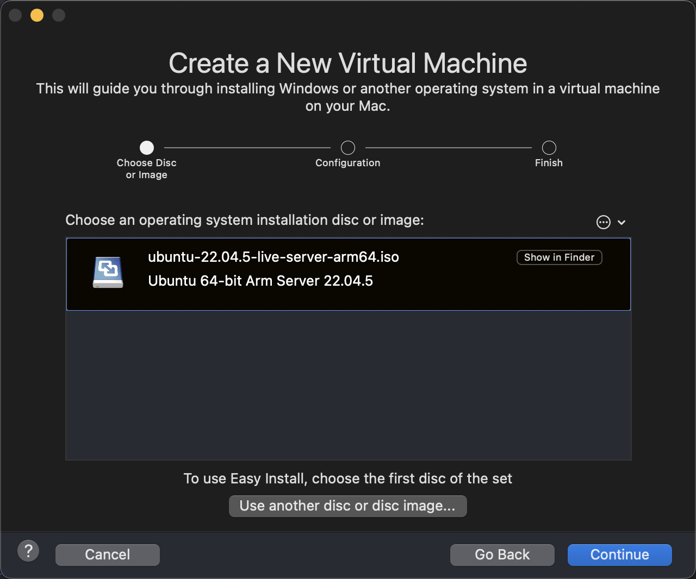

In the next screen, make sure that 2 CPUs and 4 GB of RAM are selected. Click on `Finish`.

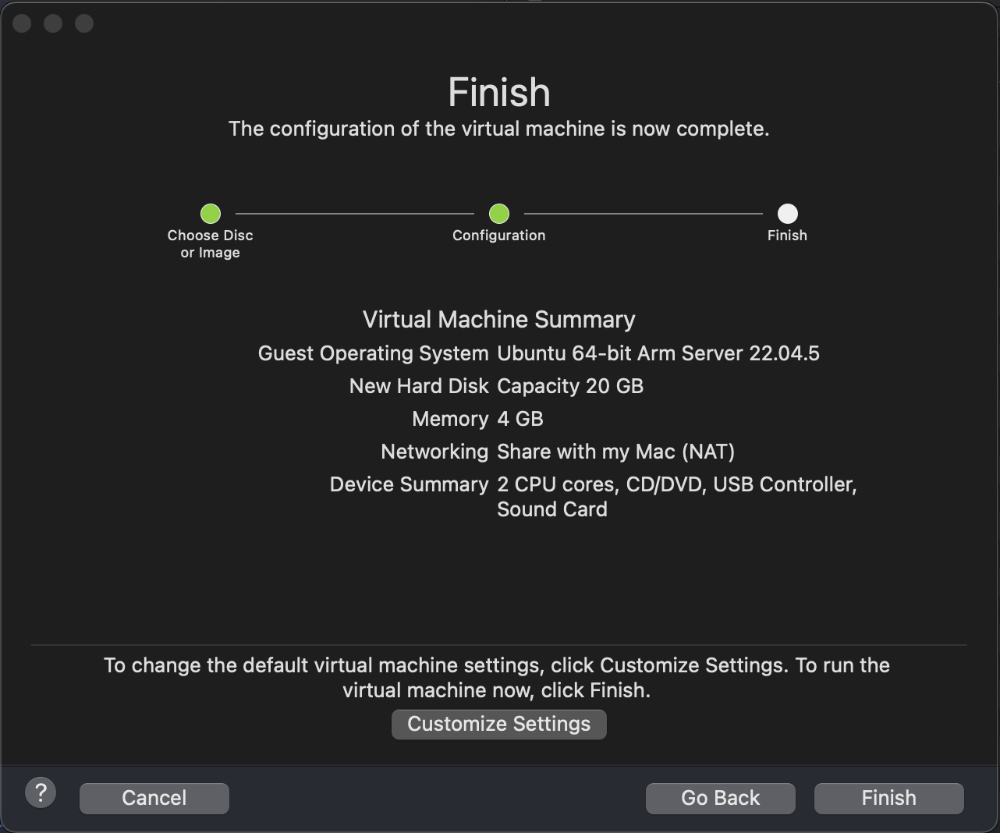

The VM will be created and started. After the VM is started, click on `Try or install Ubuntu Server`.

We will be greeted with the installation interface. Following the instructions below:

- Select the language as English.

	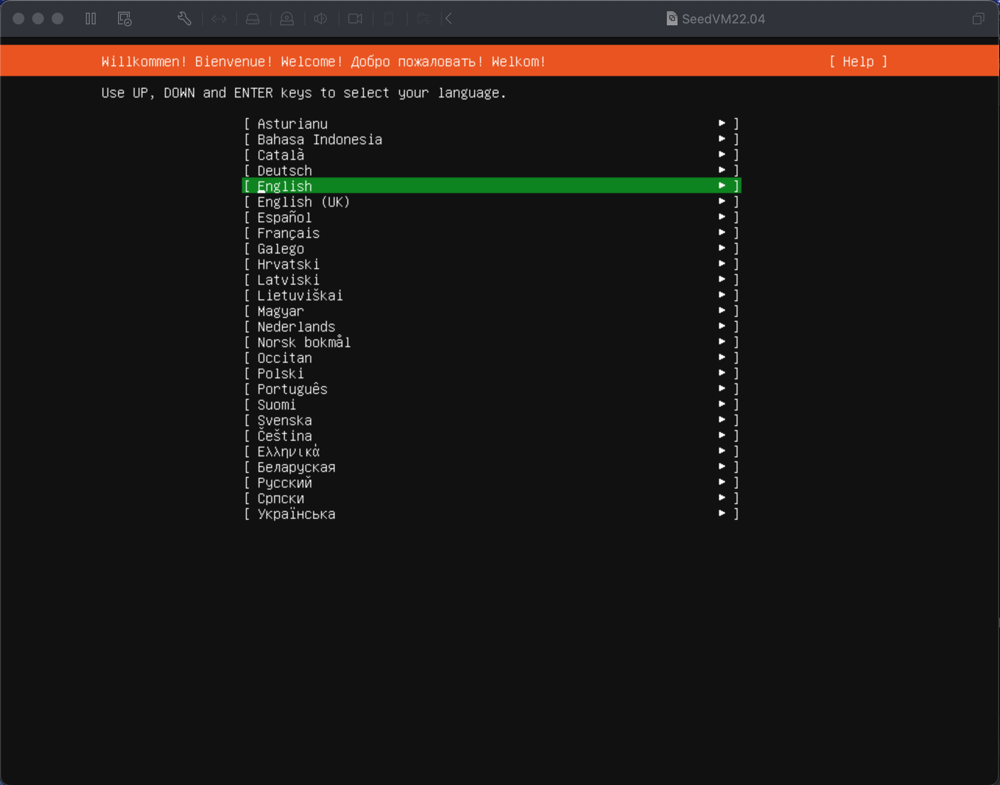
	

- For available installer update, select `Continue without updating`.

	
	
- For Keyboard Configuration, select `Done` directly.

	
	
- For Type of Installation, select `Ubuntu Server` and `Done`

	
	
- For Network Configuration, select `Done` directly.

	
	
-  For Proxy Configuration, select `Done` directly.

	
	
- For Ubuntu Archive Mirror Configuration, wait until it complete the mirror location test and select `Done` directly.

	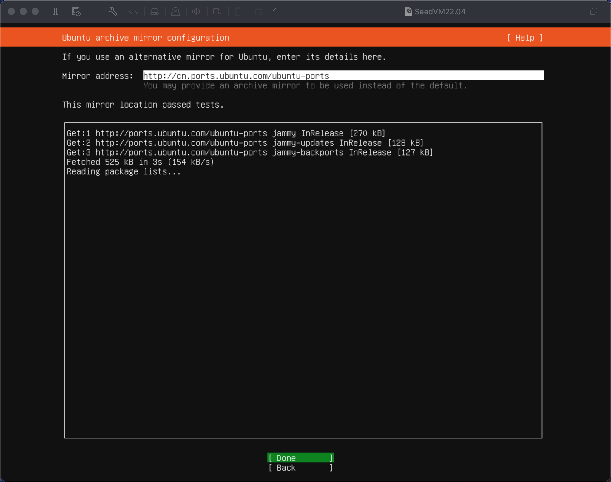
	
- For Guided Storage Configuration, select `Done` directly.

	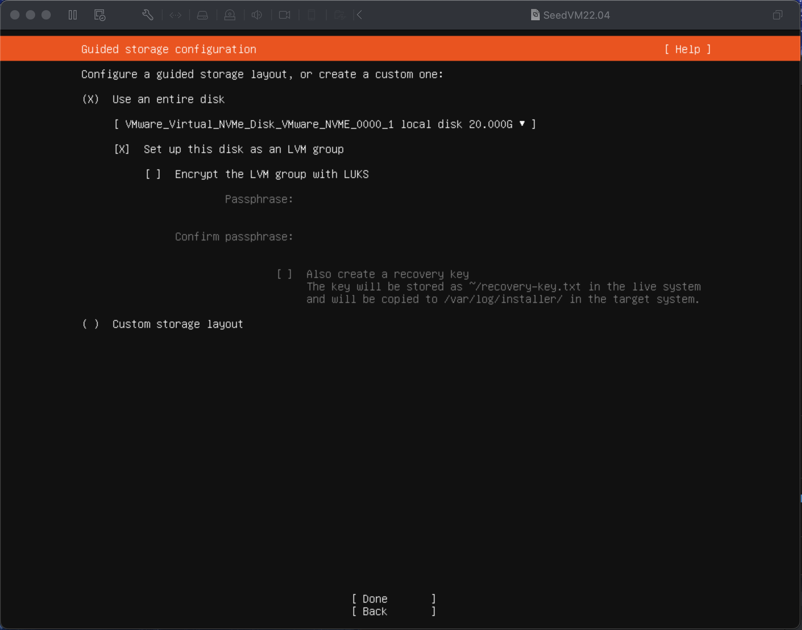
	
- For Storage Configuration, select `Done` and `Continue` directly.

	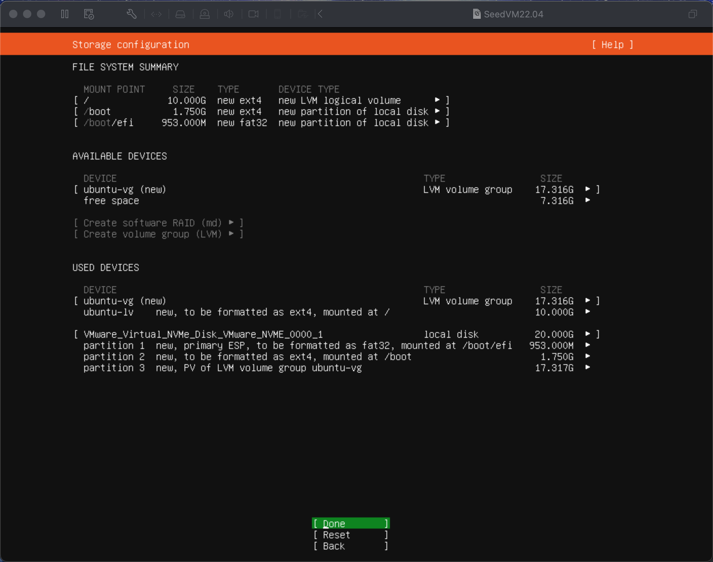
	
- For Profile Configuration, create a user with name `seed` and select a password (you can use the standard password `dees` that we use for all SEED VMs). Then select `Done`.

	
	
- For Upgrade to Ubuntu Pro, select `Continue` directly.

	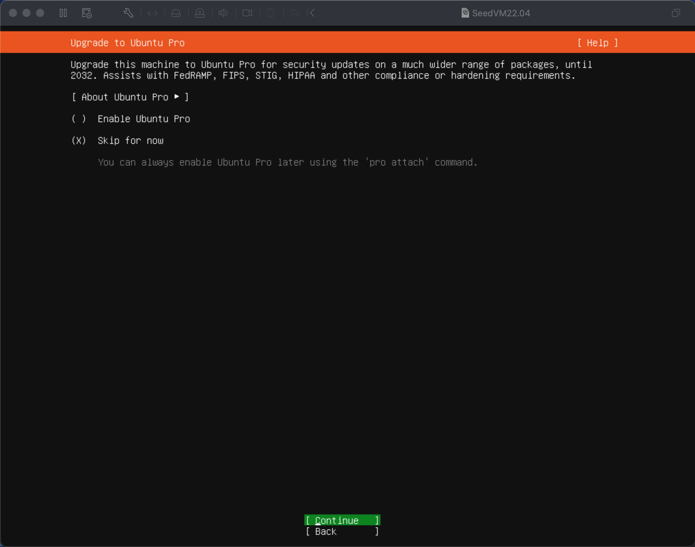
	
- For SSH Configuration, we recommend you to enable it, so select `Install OpenSSH server` and `Done`.

	
	
- For Featured Server Snaps, select `Done` directly.

	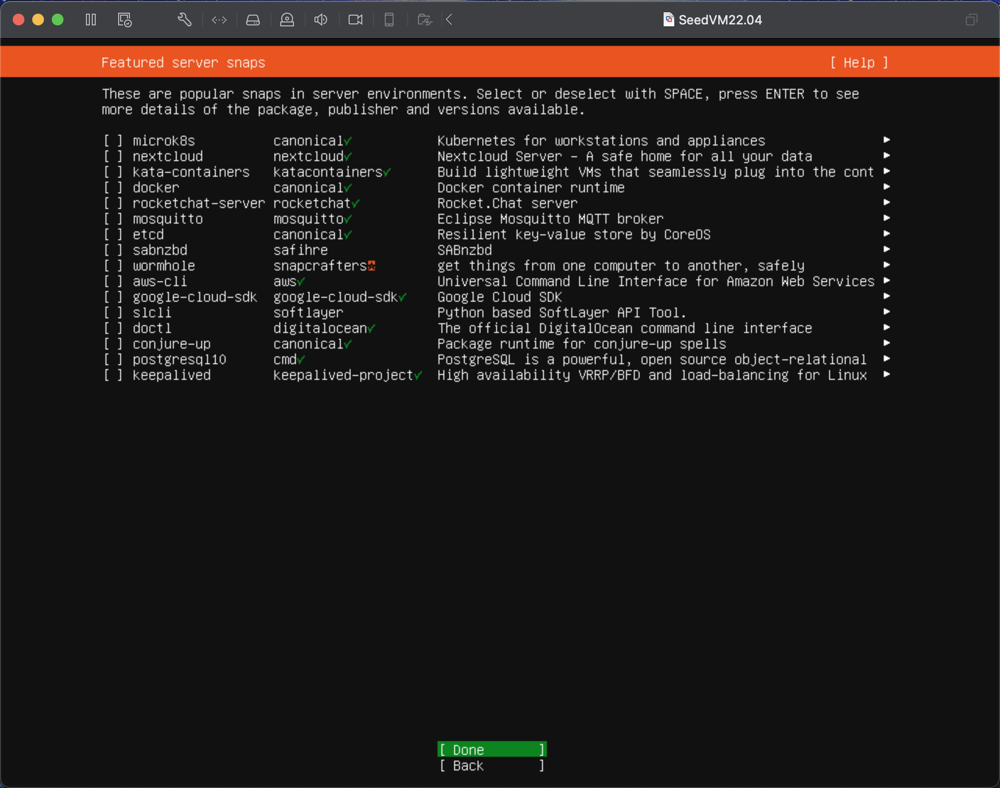
	
- Wait until it finish the installation and select `Reboot Now`

	
	
- Maybe you will encounter the situation like `Failed unmounting /cdrom`, press enter directly.

	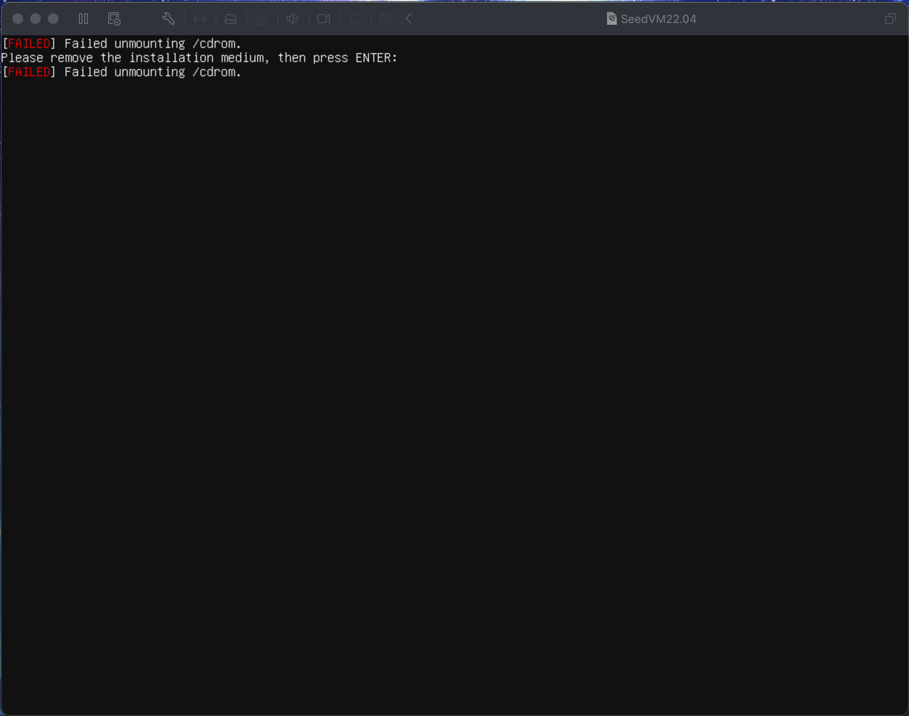
After the cloud-init operation, press enter and login your account:

***
## Step 2: Install Ubuntu Desktop

In some of our labs, we are required to have a GUI to check the result. We will install ubuntu-desktop in the VM to get it. Use `sudo apt update` first and `sudo apt install ubuntu-desktop`

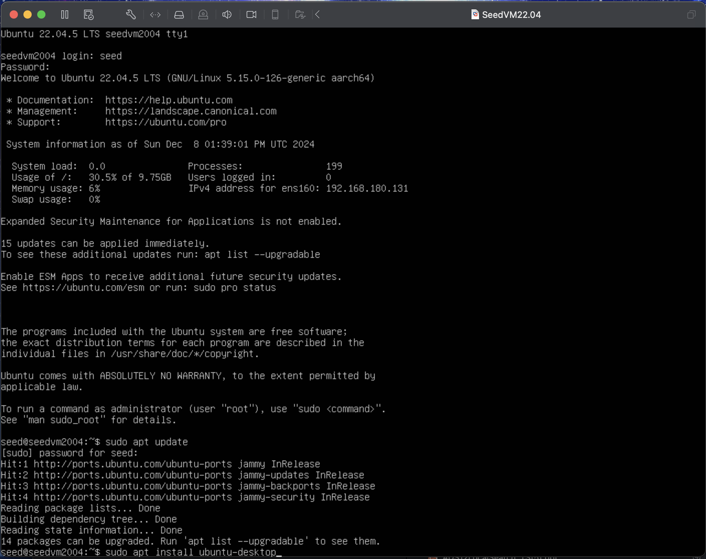

Wait until it finishes the installation. This may take long. Then `sudo reboot` and we will get the GUI we want!

