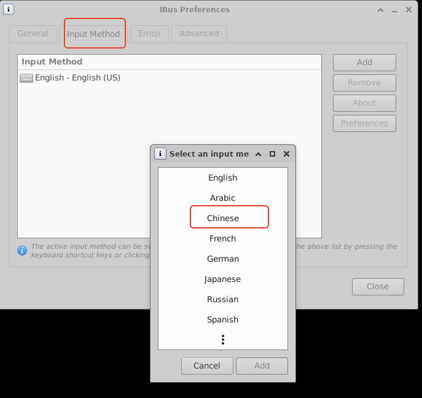
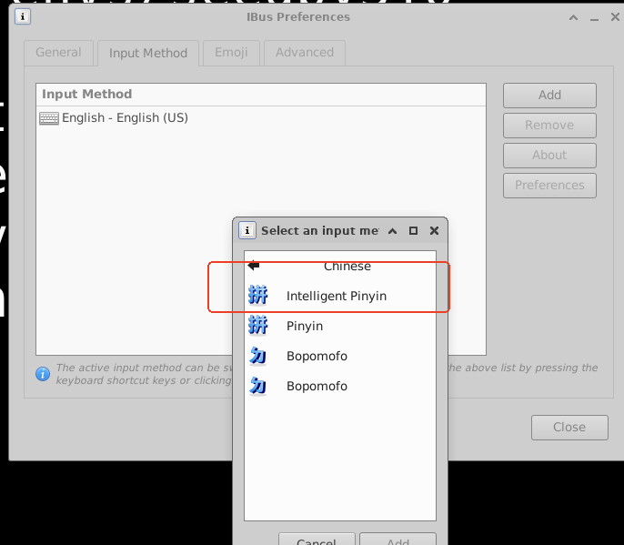

# About This Folder
this floder is to help install our seed evnvironment
on your machine cloud/desktop


## Step 1: Install Software and Configure System

If you have already installed the Ubuntu 24.04 VM on your machine,you can follow the steps below .
When the Ubuntu 24.04 VM is built, a default username with the root privilege   
will be created in the system. The actual name of the user is typically
chosen by the cloud operator. Most cloud platforms will provide
a method for you to SSH into this account. Please log into the VM, and do the followings:

Download or git clone this project, and `cd` into `ubuntu24.04-vm/src-cloud` folder, run the 
following command to install software
and configure the system.
  ```
  chmod +x install.sh
  ./install.sh
  ```
- **Note:** This shell script will download and install all the software needed for
  the SEED labs. The whole process will take a few minutes. Please
  don't leave, because you will be asked to make choices:

  - During the installation of vscode, you will be asked
    whether Add Microsoft apt repository for Visual Studio Code?
    Select `No`.

  - During the installation of Wireshark, you will be asked
    whether non-superuser should be able to capture packets.
    Select `No`.

  - During the installation of `xfce4`, you will be asked to
    choose a default display manager. Choose `LightDM`.

**If you want to use the Chinese input method, please follow the steps below:**
run the follow command after install    
```
ibus-daemon -drx
ibus-setup
```
change your `input source` add `Chinese` -> `intellgient PPinyin`

After the script finishes, a new account called `seed` is created,
We will use this account for all the SEED labs, instead of the default one
created by the cloud. We intentionally did not set a password for this account,
so nobody can directly log into this account. We can switch to the `seed`
account using the following command (if you do not use `sudo`, the OS
will ask you to type the password, making it impossible to log in):
```
sudo su seed
```

## Step 3 (Option A): Access the VM Using VNC

For most labs, being able to SSH into the VM should be sufficient.
Some labs do need to access GUI applications on the VM, such as
Firefox and Wireshark. If your network bandwidth is not too
bad, being able to get a graphical desktop of the remote VM is
always more desirable than getting a text terminal via SSH.
We will use VNC (Virtual Network Computing) to get the remote
desktop.

- **On the cloud VM:** We need to make sure that we are in
  the `seed` account. If you are still in the default account, do
  the following, and you will be in the `seed` account:
  ```
  sudo su seed
  ```

  Our installation script has already installed
  the TigerVNC server program on the VM. You need to start the
  server.
  ```
  tigervncserver :1 -localhost no -geometry 1920x1080 -depth 24 -xstartup /usr/bin/startxfce4
  ```  

  By default, TigerVNC server only listens to localhost/127.0.0.1. The
  purpose of the `-localhost no` option means accepting access from the
  outside. When we first start the `tigervncserver`, we will be asked to provide a
  password. Make sure this password is strong enough. Moreover, VNC
  communication itself is not encrypted, so you should not send anything
  personal. If you do want to secure it, you can run an SSH tunnel or VPN
  tunnel to protect the VNC communication.

- **On your computer:** You need to have a VNC viewer installed
  on your computer, such as [TigerVNC](https://tigervnc.org/), and
  [RealVNC](https://www.realvnc.com/en/connect/download/viewer/).
  If you prefer other VNC viewers,
  it is fine. Most of them are compatible with one another.
  Some users have reported that TigerVNC have issues on macOS,
  but RealVNC has no problem.

  Start your VNC viewer program, and type the IP address of the VM, along with
  the port number, such as `35.236.203.131:5901`. Most cloud VMs have two
  IP addresses; make sure you use the external IP address, not the internal
  one. You will be prompted for password, which is the one you typed
  when you first run the VNC server. If everything is done correctly,
  you will see the desktop of your remote VM.

- If you VNC does not work, check your firewall to make sure TCP traffics
  to the port `5901` on the VM is allowed. Also check whether your VNC server
  is running properly. Here are some useful commands to help you manage the VNC server on the VM:
  ```
  vncserver -list       # List the VNC server sessions
  vncserver -kill :1    # Kill the session for :1 display
  ```

## Step 3 (Option B): Access the VM Using SSH

To run VNC, you need to have reasonable bandwidth. If your VNC performance
is bad, you should switch to SSH. You can get by with many of the
SEED labs using just terminals. There are many ways to SSH into the
cloud VM:

- Most cloud platforms provide a default browser-based SSH client.
  Google cloud's SSH client even allows you to upload and download files,
  which is very convenient.

- You can also find many third-party SSH clients. Some clouds may have
  disabled the password authentication in SSH, so you have to use
  public keys for the authentication.
  You need to generate public/private key pairs on your SSH client machine,
  and save the public key into the `/home/seed/.ssh/authorized_keys` file on
  the server machine. You can easily find
  instructions from online resources, so we will not provide one here.


## Notes on Cost

Unless you have a special deal with cloud company, you will
be charged for using the cloud VM. Please keep an eye on your bill,
because sometimes, there are costs that you may
not be aware of, such as bandwidth cost, storage cost, etc.
Understanding where your expense is can help you reduce it.
Moreover, to avoid wasting money, remember to
suspend your VMs if you are not working on them. Although a
suspended VM still incurs storage cost (usually very small), it
does not incur any computing costs. You can easily resume them
when you are ready to continue your work.


## install chinese input method


```
sudo su   seed
./install_chn_input.sh
```

