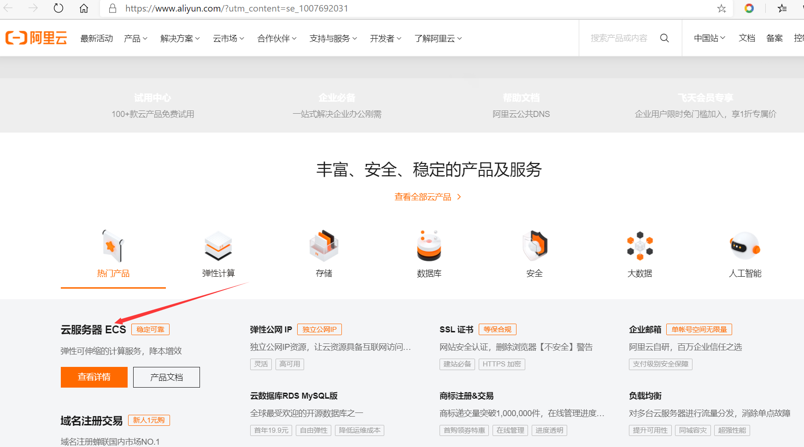
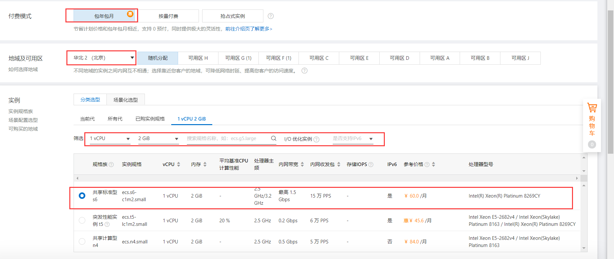
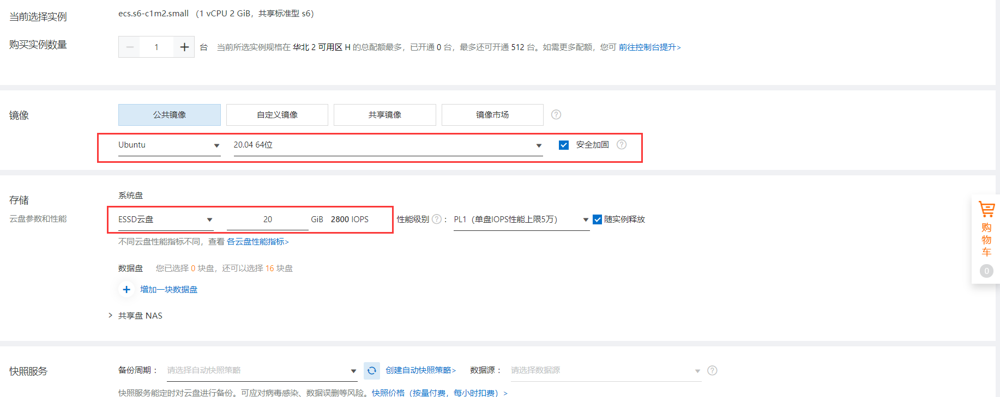
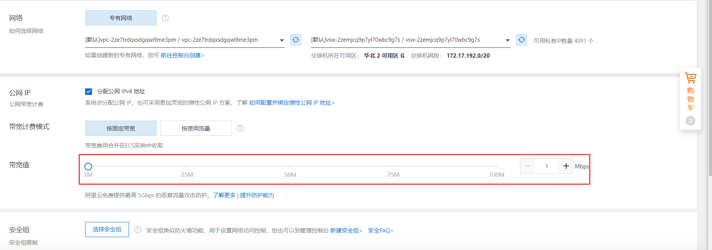
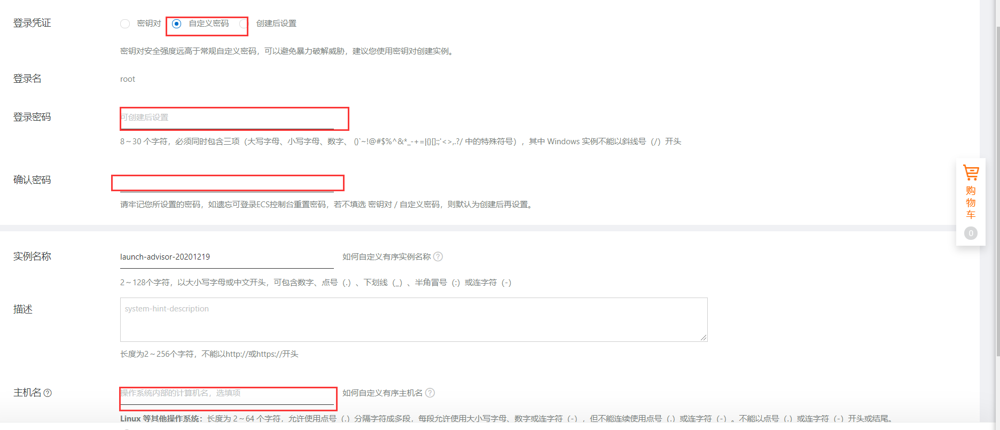
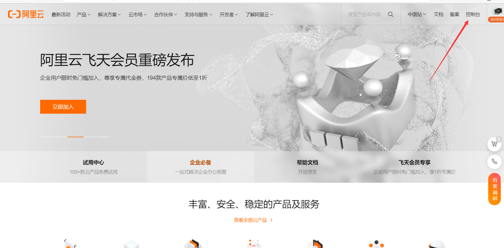
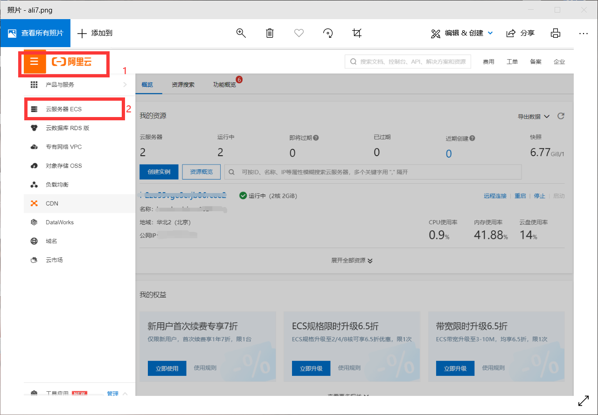
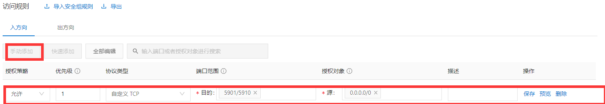

# 在阿里云上创建虚拟机
## 登录阿里云
略
## 点击云服务器ESC

## 点击立即购买
进入选配页面
## 进行选配
您可以根据自己的需求来选择付费模式及地域；关键环节是选择服务器的配置；（SEED VM 的最小配置为 1 vCPU、2 GB 内存和 10 GB 磁盘空间）所以这里选择1vCPU、2GB内存、20GB配置。

## 选择镜像
这里选择ubuntu20镜像

## 点击下一步配置网络安全组
根据需求选择带宽

## 点击下一步配置系统配置
配置登陆密码与主机名

## 确认订单购买后进入控制台

## 查看云服务器ESC

## 进入实例配置安全组

## 开启端口
安全组出方向默认允许所有访问，即从安全组内ECS访问外部都是放行的。因此只需要配置入方向的5901-5910端口即可。

## 连接服务器
您可以使用任意的ssh连接工具连接到服务器进行seed-labs搭建环节。