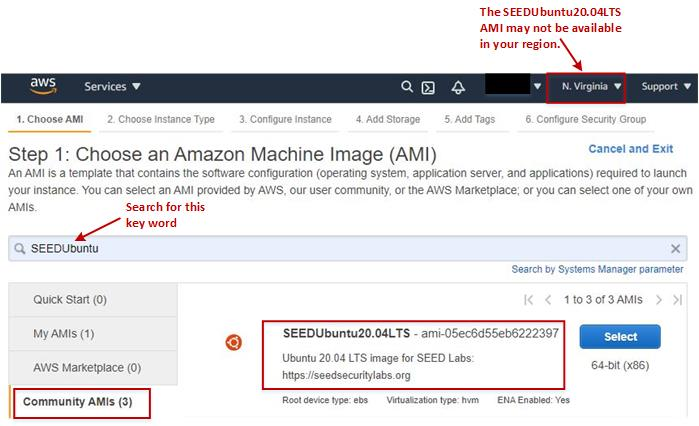
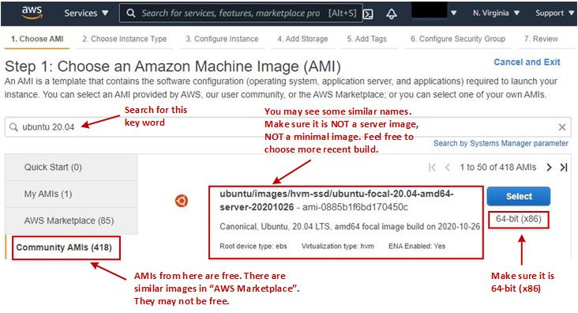
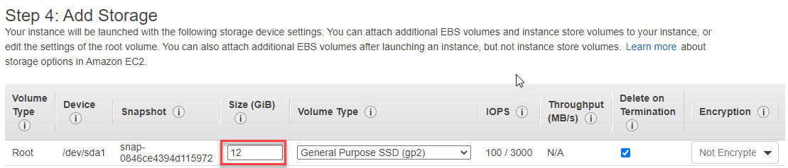
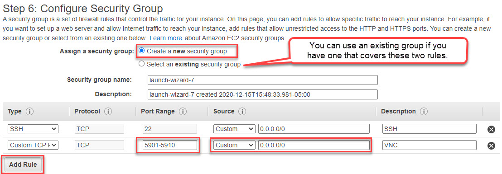
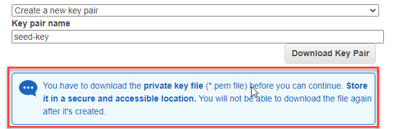
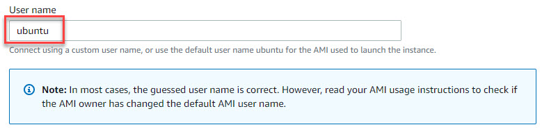

# Creating SEED VM on Amazon Web Services (AWS)

## Step 1: Choose an Amazon Machine Image 

We will build a Ubuntu Server 20.04 64-bit (x86) image. There are two options.

- **Use a SEEDUbuntu20.04 AMI:** 
We have created a community AMI, and made it available 
in several regions. This image already installed all the software packages 
for the SEED labs, and is already configured. If you use this image, 
your job is much simplified. 

  

- **Use an Ubuntu 20.04 AMI:** If the SEEDUbuntu20.04 AMI is not available in 
your region, or you just want to build a SEED image yourselves, you can 
select a generic Ubuntu 20.04 image from community AMIs.

  


## Step 2: Choose an Instance Type 

We need to choose an instance type for our virtual machine. Different 
type has different cost. The minimal configuration for SEED VM is 
1 vCPU, 2GB of memory, and 10 GB of disk space. The `t3-small` type is
recommended (it has 2 vCPU and 2GB of memory). If you are concerned
about the cost, you can start with a small configuration, and change
it easily later (using the `Actions` --> `Instance setting` menu).

After selecting the type, you can click `Review and Launch`, and you will
directly jump to the `Review` Step.  We need to go back a little bit to
Steps 4 and 6 to add storage and configure the firewalls.

  

## Step 4: Add Storage

By default, AWS set the storage size to 8GB. This is barely enough for SEED
labs. We need to increase it to 12GB minimal. You should be 
noted that the size does affect the cost, although not by much. 

  


## Step 6: Configure Security Group (Firewall)

We need to add firewall rules to allow two types of access, SSH and VNC. 
By default, AWS already added the rule to allow SSH, so we just need to 
add one rule to allow VNC. By default, VNC server listens to port 5900 + N,
where N is the display number. For display `:1`, the port number is 
`5901`. To allow VNC server to have multiple windows, we specify 
a port range in the rule. 
After this step, the VM instance is created, and we are ready to launch this 
instance. 

  


## Step A.1: Create/Select Key Pair

In order to be able to SSH into the VM instance, we need to create 
a key pair or use an existing one that you created before. AWS will
save the public key part of this pair to the `.ssh/authorized_keys` 
file inside the accounts created in the VM. This allows you to log into
those accounts using the private key part of the pair.

If you choose to create a new key pair, make sure you download the key file,
and save it in a secure place (see the notice in the figure). You need the 
key when you use a third-party SSH client to log into the server.

  


## Step A.2: SSH into VM 

There are two typical ways to SSH into an AWS VM. Before doing that,
we need to make sure that the VM instance is running. You can 
start it from the AWS console if it is not running. 

**From a web browser:** After selecting an VM instance on the AWS Console, 
you can click the `Connect` button. A new window will come up. You need to 
type a user name. If you use a generic Ubuntu AMI, typically, `root` and `ubuntu` 
are the accounts created. If you use our SEEDUbuntu AMI, in addition to these
two accounts, we have created a `seed` account. In this case, you can just
directly type `seed`.

  


**From a Terminal:** If you prefer to SSH into the VM from a third-party
SSH client, you can do that with the key that you have downloaded in
the previous step. There are many SSH client programs, and their usages
are different. The following example is for Linux:

```
ssh -i <private key file> ubuntu@<external IP address of instance>
# example: ssh -i seed-key.pem ubuntu@12.34.56.78
```

