# Creating SEED VM on Amazon Web Services (AWS)
## Step 1: Create an EC2 instance
In AWS homepage, select "Services", click "EC2" in "Compute" section, come into the homepage of EC2 management console.
  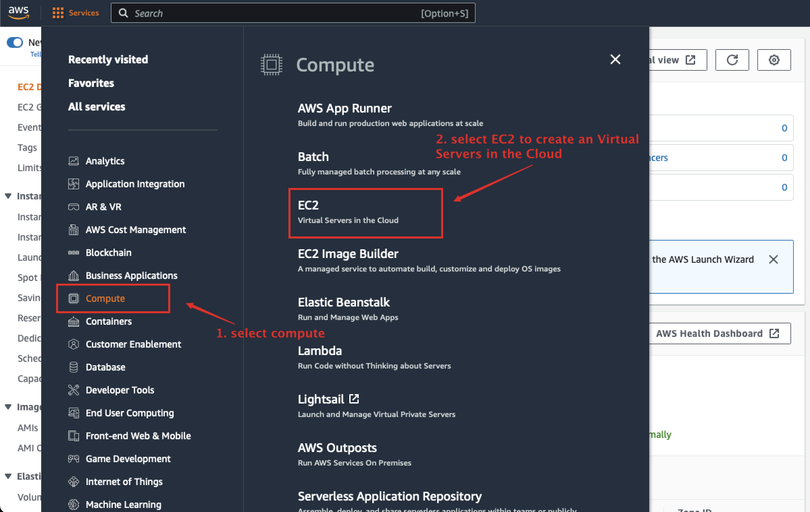

To get started, click "Launch instance" to start an Amazon EC2 instance,which is a virtual server in the cloud.

  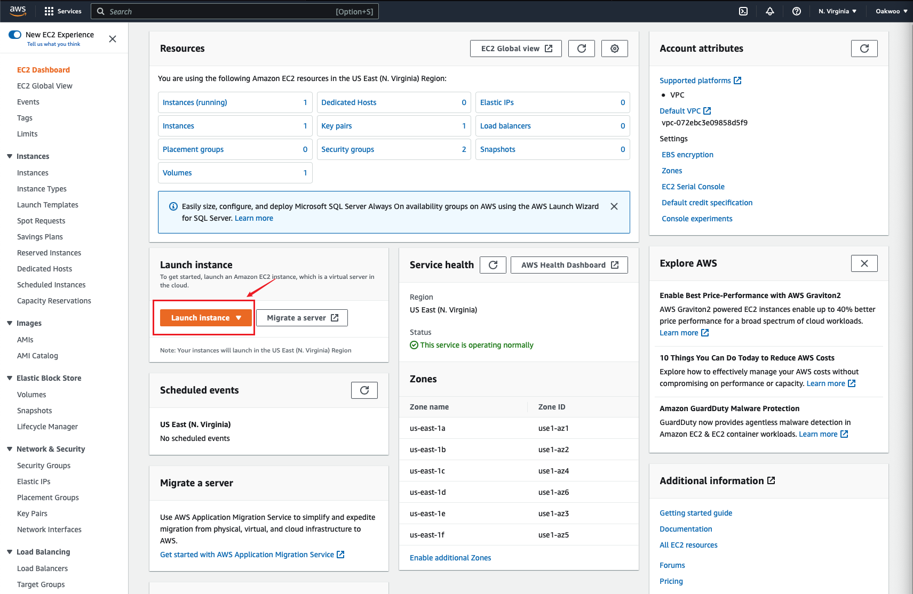
## Step 2: Choose an Amazon Machine Image
We will build a Ubuntu Server 20.04 64-bit (x86) image.
- **Use an Ubuntu 20.04 AMI:** you want to build a SEED image yourselves, you can
select a generic Ubuntu 20.04 image from community AMIs.

  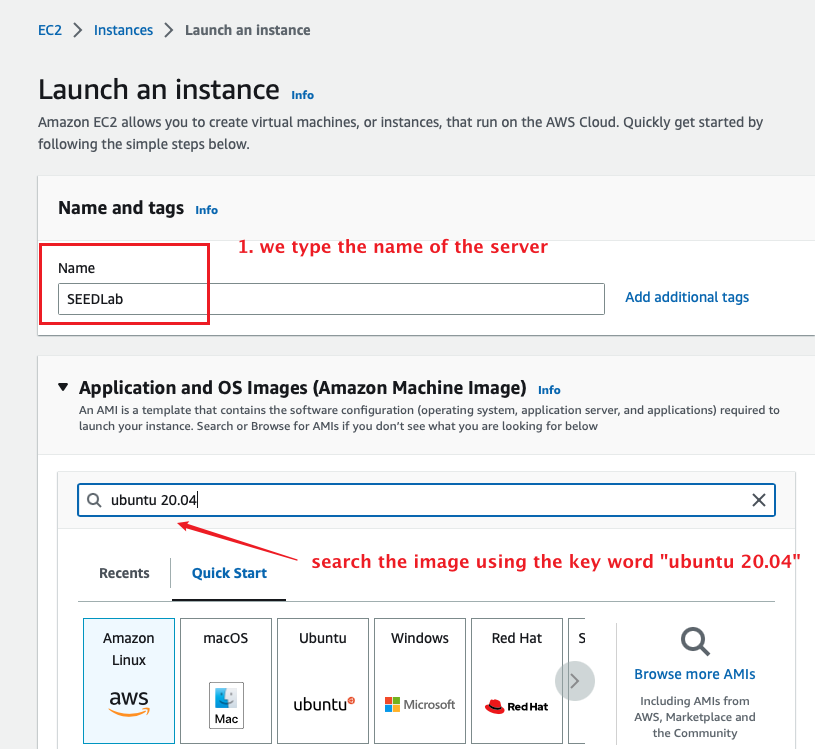

  In the choose image page, select appropriate image.

  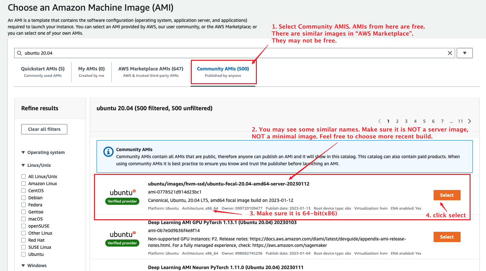

## Step 3: Choose an Instance Type

We need to choose an instance type for our virtual machine. Different
type has different cost. The minimal configuration for SEED VM is
1 vCPU, 2GB of memory, and 10 GB of disk space. The `t3-small` type is
recommended (it has 2 vCPU and 2GB of memory). If you are concerned
about the cost, you can start with a small configuration, and change
it easily later (using the `Actions` --> `Instance setting` menu).

  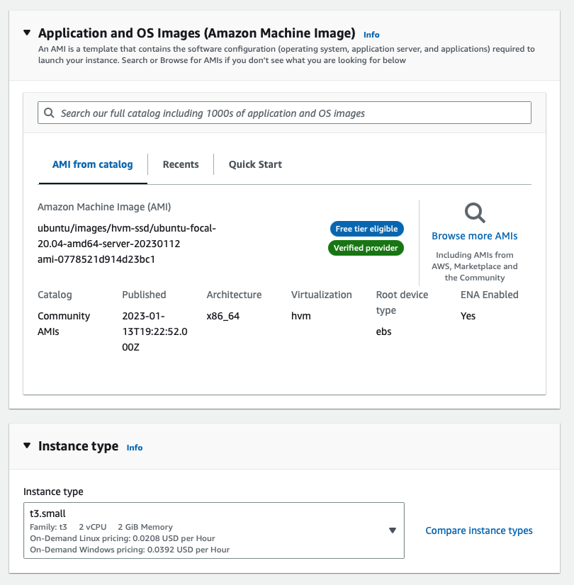

## Step 4: Create/Select Key Pair

To SSH into the VM instance, we need to create
a key pair or use an existing one that you created before. AWS will
save the public key part of this pair to the `.ssh/authorized_keys`
file inside the accounts created in the VM. This allows you to log into
those accounts using the private key part of the pair.

If you choose to create a new key pair, make sure you download the private key file(*.pem file), and save it in a secure and accessible place. You will not be able to download the file again after it's created. You need the key when you use a third-party SSH client to log into the server.

  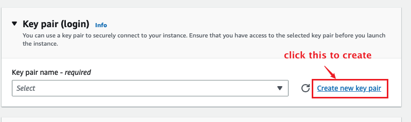

  

## Step 5: Configure Security Group (Firewall)

We need to add firewall rules to allow two types of access, SSH and VNC.
By default, AWS already added the rule to allow SSH, so we just need to
add one rule to allow VNC. VNC server listens to port 5900 + N,
where N is the display number. For display `:1`, the port number is
`5901`. To allow VNC server to have multiple displays, we specify
a port range in the rule.

  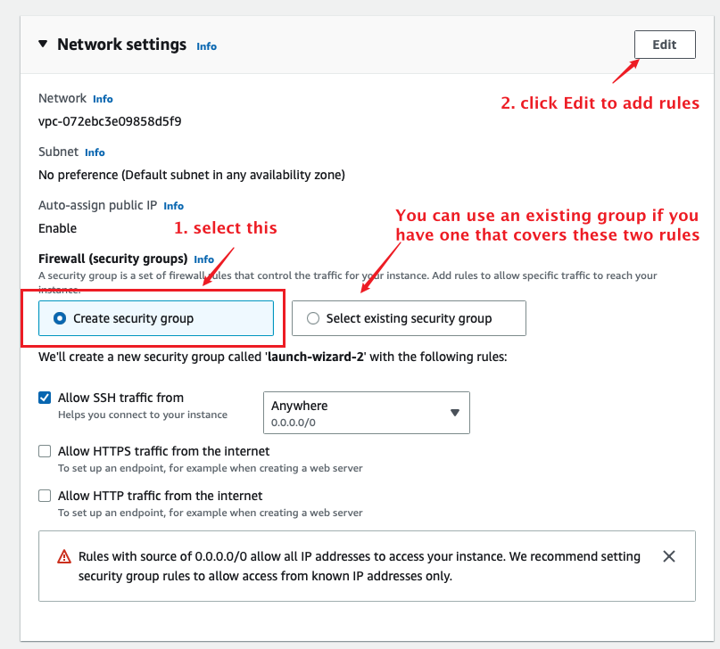

  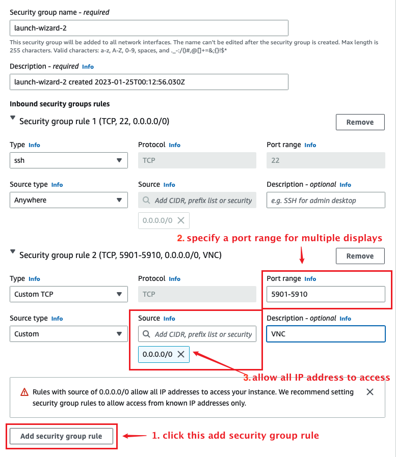

## Step 6: Add Storage

By default, AWS sets the storage size to 8GB. This is barely enough for SEED
labs. We need to increase it to 12GB minimal. You should be
noted that the size does affect the cost, although not by much.

  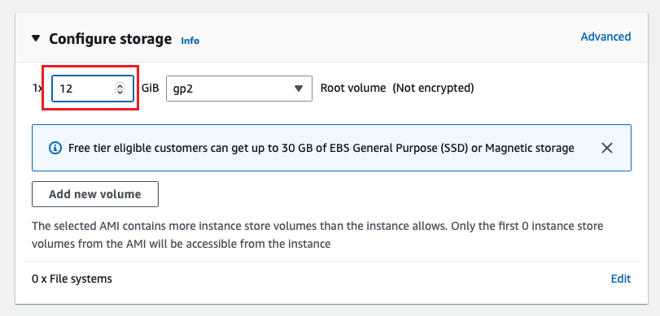

After this step, the VM instance is created, and we are ready to launch this instance.

  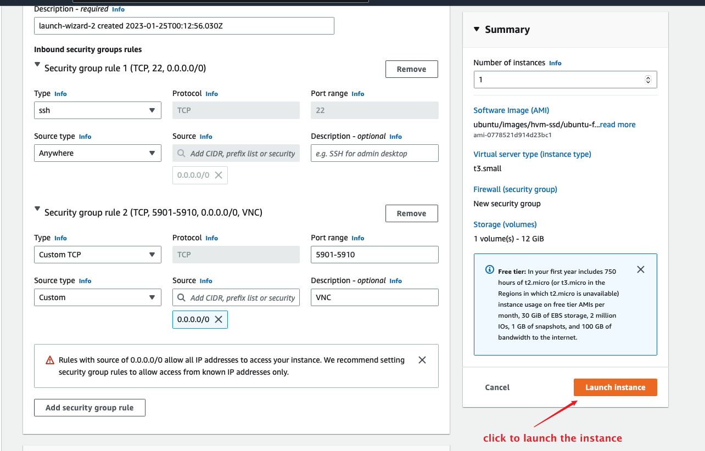

  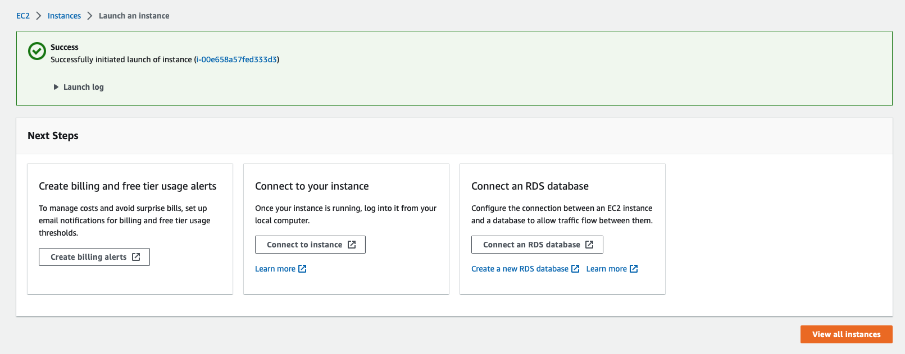

## appendix A: SSH into VM

There are two typical ways to SSH into an AWS VM. Before doing that,
we need to make sure that the VM instance is running. You can
start it from the AWS console if it is not running.

**From a web browser:** After selecting an VM instance on the AWS Console,
you can click the `Connect` button.

  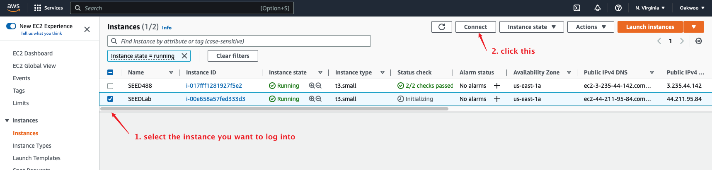

A new window will come up. You need to
type a user name. In a typical Ubuntu 20.04 AMI, `root` and `ubuntu`
are the accounts created, and their `.ssh/authorized_keys` have already
been set up using the keys you provided in the previous step.

  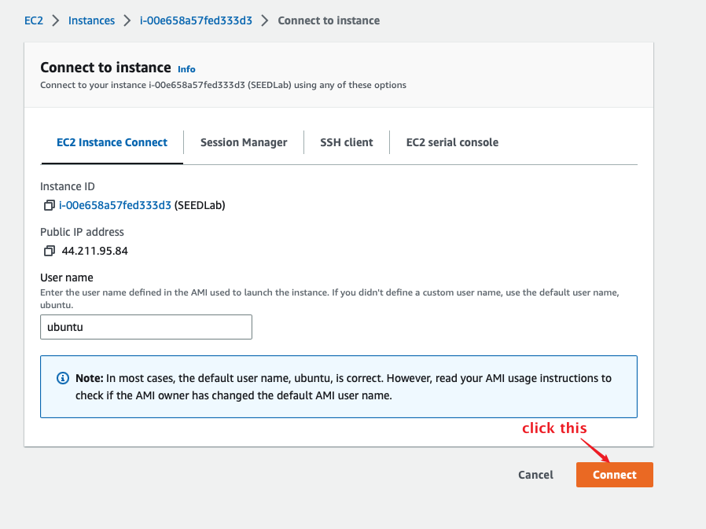

**From a Terminal:** If you prefer to SSH into the VM from a third-party
SSH client, you can do that with the key that you have downloaded in
the previous step. There are many SSH client programs, and their usages
are different.
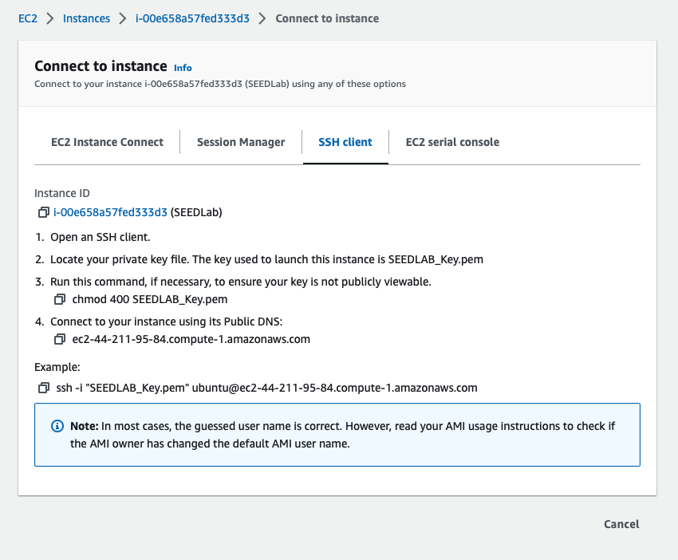

The following example is for macOS terminal:

1. first go to the folder where key file stores
2. Run command `chmod 400 <Your key file name>` to set the key file permission, my key file name is “SEEDLAB_Key.pem”, your key file name may be different as mine.
3. Run command `ssh -i <private key file> ubuntu@<external IP address of instance>` to connect with server, you can directly copy that from your AWS webpage, each server has different name.

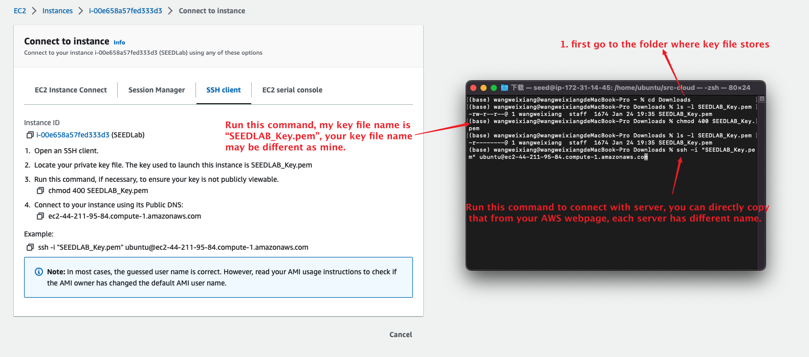
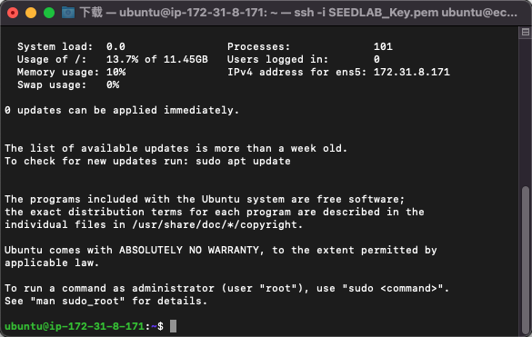
