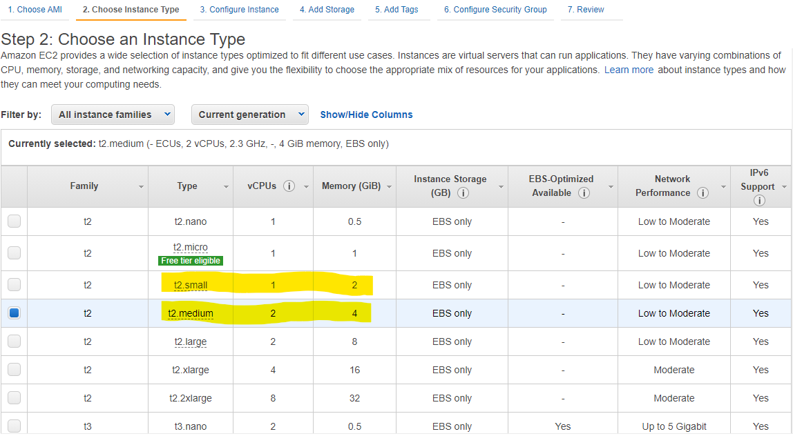
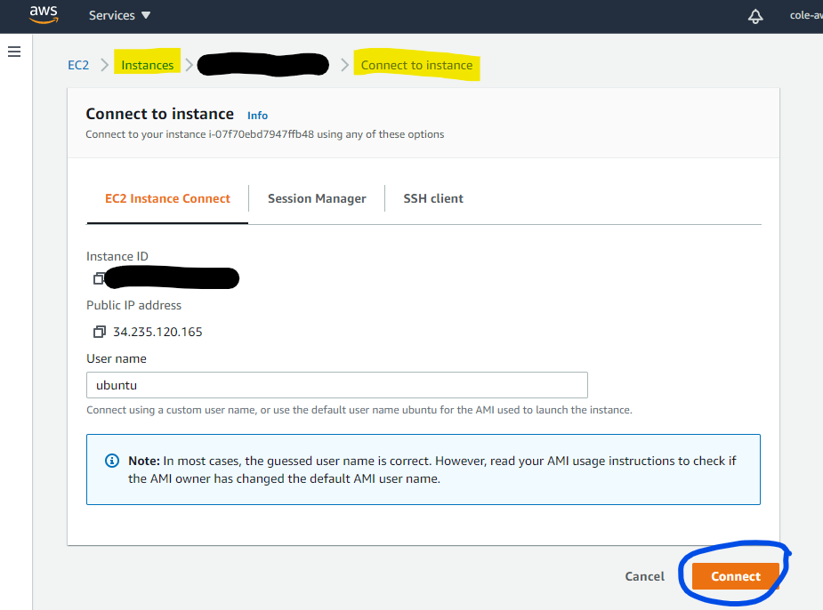

# Creating SEED VM on Amazon Web Services (AWS)

When creating an EC2 instance, we suggest the following parameters:

- Instance: Ubuntu Server 20.04 64-bit (x86)

  

- Instance type: t1-medium recommendend (2 vCPUs, 4GB RAM), t1-small
  possible (1 vCPU, 2GB RAM)

  

- Security group: add policy for custom TCP connections, port range 5901-5910, src IPs 0.0.0.0/0

  

- Keypair: create new keypair

  

Download the private key (.pem file) to a secure location (e.g. the ~/.ssh/
directory). Change permissions on the .pem file to be read-only by owner, not visible to
any other (`chmod 400 <private key file>` on a Linux machine). 

## SSH into VM 

We need to SSH into the VM. There are two typical ways to do that.

**From a Terminal:** Launch the AMI, then connect via SSH:

```
ssh -i <private key file> ubuntu@<external IP address of instance>
# example: ssh -i ~/.ssh/pk.pem ubuntu@12.34.56.78
```

**From a web browser:** Use the AWS Console's "Connect to Instance" feature to connect through
a browser.

  


