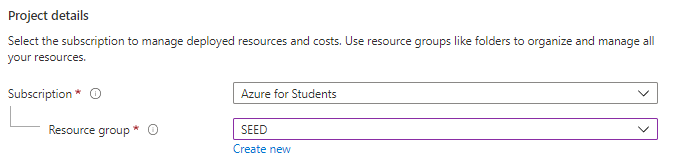
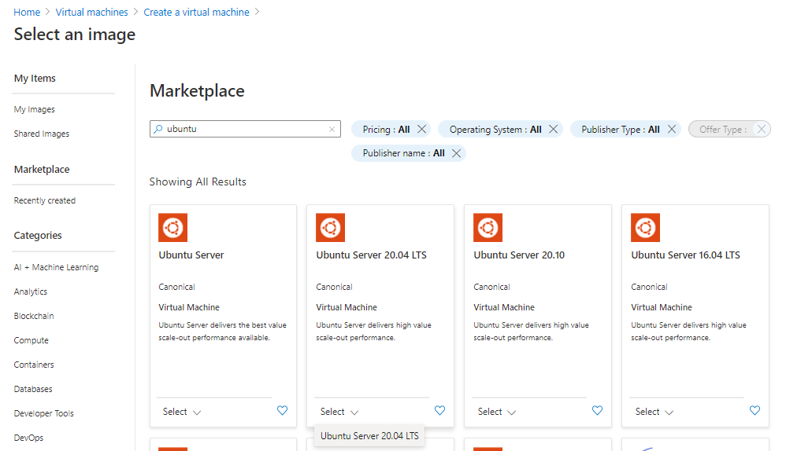
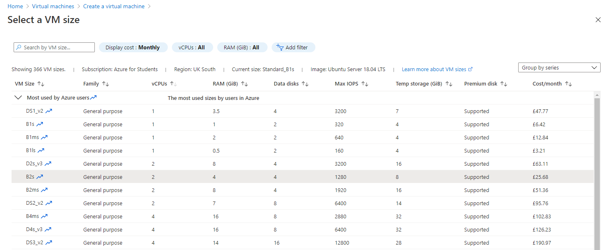
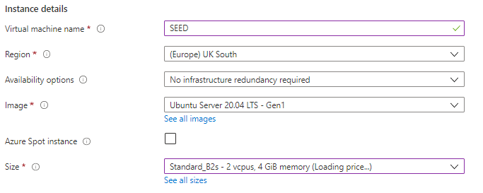
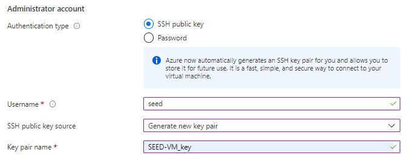
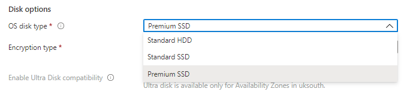
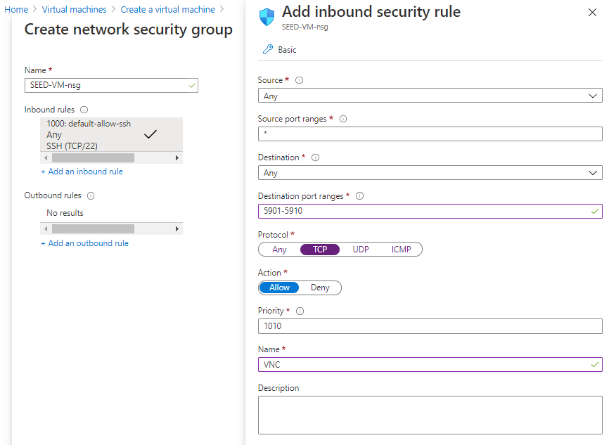
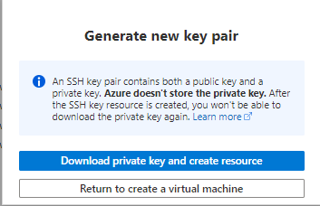
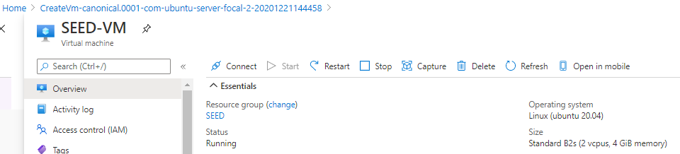

# Creating a VM Instance on Microsoft Azure

## Step 1: Sign into Azure

Sign in to the Azure portal at https://portal.azure.com.

## Step 2: Create a Virtual Machine

Type **virtual machines** in the search box. Under **Services**, select **Virtual machines**. In the **Virtual machines** page, select **Add**.

### Step 2A: Basics tab

On the **Basics** tab, enter the following details.

#### Project Details

Ensure you have selected your correct Azure **Subscription** and **Resource Group**. If necessary, create a new group for your SEED VMs.



#### Instance Details

Give the VM a suitable **Name** and select an Azure **Region** that is appropriate to your location.

The base **Image** should be changed to **Ubuntu Server 20.04 LTS - Gen 1**. Click on **See all images** to view the market place and enter **ubuntu** in the search box. Select **Ubuntu Server 20.04 LTS**.



The VM Size should be selected. Different types have different costs associated with them and the correct one for your needs should be selected. The minimum configuration for a SEED VM is 1 vCPU and 2GB of RAM. This equates to a `B1ms` Azure instance type and is sufficient to run most, but not all of the Labs.

The recommended configuration is 2v vCPU and 4GB RAM. This equates to a `B2s` Azure instance type. Select **See all sizes** to view the instance types and select **B2s**.



Once complete, your **Instance Details** section should look similar to the following:



#### Administrator Account

Change the **Username** to **seed**.

Leave the **Authentication type** as **SSH public key** and either supply an existing private ssh key in **SSH public key source** or **Generate new key pair**. You will be given an opportunity to download the new key once the VM is created.



#### Inbound port rules

Leave the default options for **Public inbound ports** to allow inbound SSH connections.


### Step 2B: Disks

The **Disks** tab allows you to adjust which type of disk you use for the OS. If cost is an issue, select **Standard SSD**.



#### Step 2C: Networking

The **Networking** tab allows us to add new firewall rules to allow VNC access. The **Basics** tab has already added the rule for SSH. VNC server listens to port 5900 + N, where N is the display number. For display `:1`, the port number is `5901`. To allow VNC server to have multiple displays, we specify a port range in the rule. After this step, the VM instance is created, and we are ready to launch this instance.

Change the **NIC network security group** option to **Advanced** and click **Create new** for the **Configure network security group** option.

Set the **Destination port ranges** to **5901-5910**, change the **Protocol** to **TCP** and set the **Name** to **VNC**.

Once complete, click **Add** and **OK**.



#### Step 2D: Management

The Management tab allows you to set options such as **Auto-shutdown** and **Backup**. Configure these as appropriate, but they are not mandatory.

#### Step 2E: Review and Create

Click **Review and Create** to allow Azure to validate your configuration. Once complete, click **Create**. If you opted to create a new SSH Key pair, you will be prompted to download it at this point. This is the only opportunity to download the key. Ensure that you store it safely.



### Step 3: Connect to the VM

Check the Virtual Machine resource and ensure that it is running. If not, start the VM and wait a few minutes for it to initialise.



Connect to the Azure instance using a third-party SHH client such as `Putty` using the Private SSH key downloaded in the previous step. There are many SSH client programs, and their usages are different. The following example is for Linux:

```
chmod 400 <private key file>
ssh -i <private key file> ubuntu@<external IP address of instance>

# example: ssh -i seed-key.pem seed@12.34.56.78
```
