# Creating a VM Instance on DigitalOcean

Creating a VM instance on DigitalOcean is quite straightforward.
When you create the VM instance, we suggest the following parameters:

## Step 1: Create a new project

First you need to create a new project and fill up the basic project information

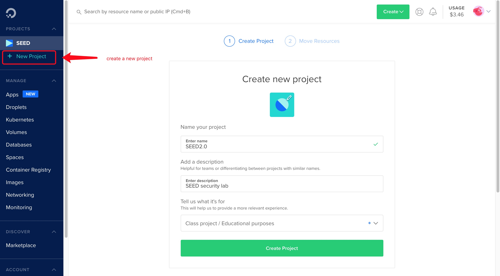

for now, because we don't have existing Droplet, we skip moving the resource into project.

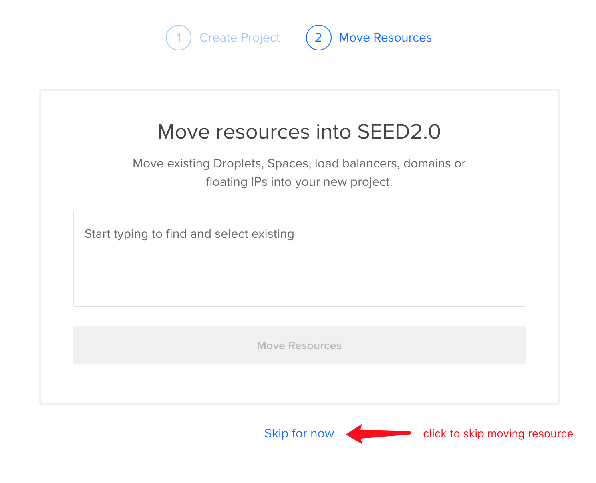

## Step 2: Create a new Droplet

Once we have created the project, we create a droplet in it.

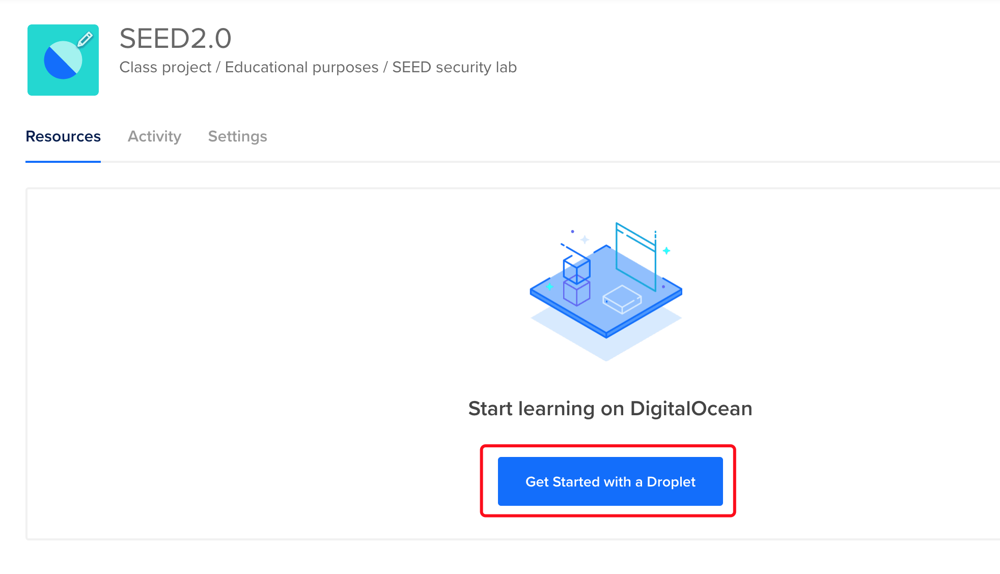

choose Ubuntu 20.04LTS operating system

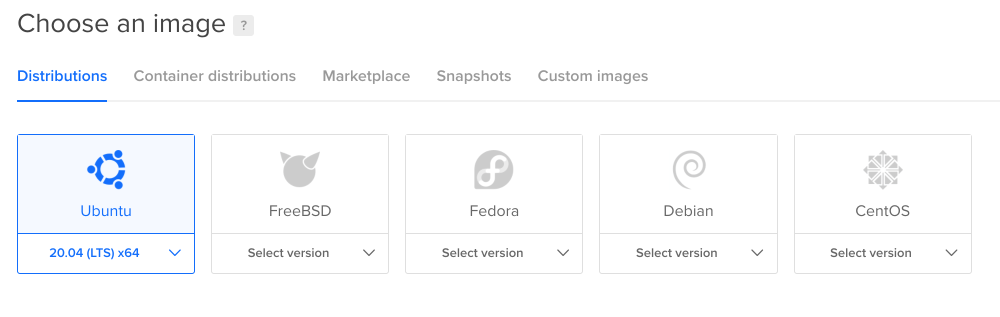

1 CPU and 2GB is sufficient for most SEED labs. You can easily change the machine configuration later after the machine is created.

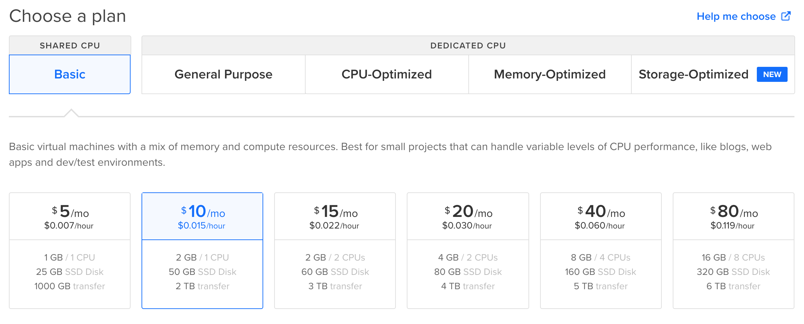

Set the root password

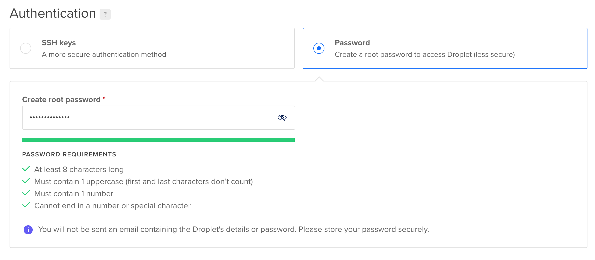

keep the other parameters as default and create the droplet.

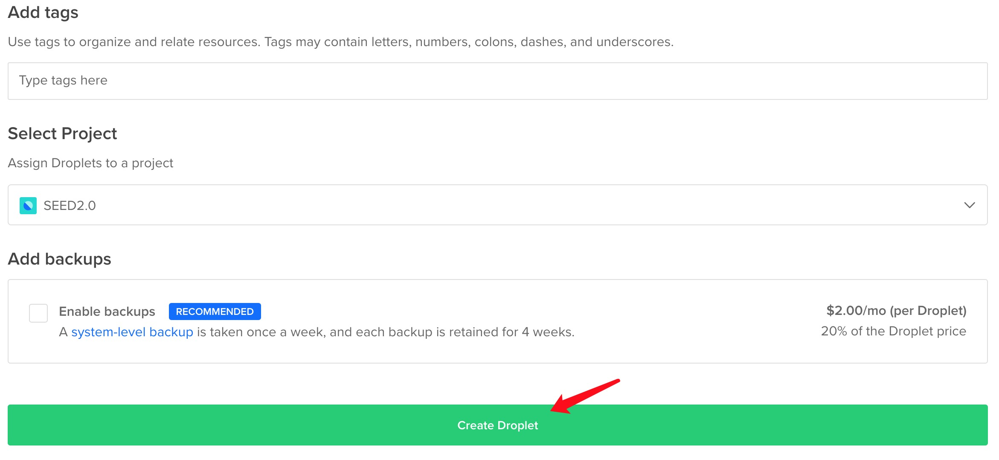

The droplet is successfully created and return the basic information about VM

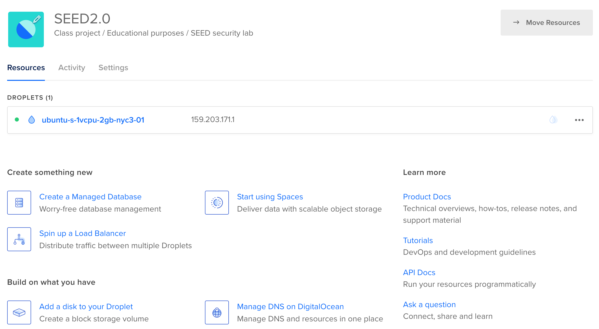

## Step 3: Access your VM

DigitalOcean provides a default browser-based SSH client for your VM.

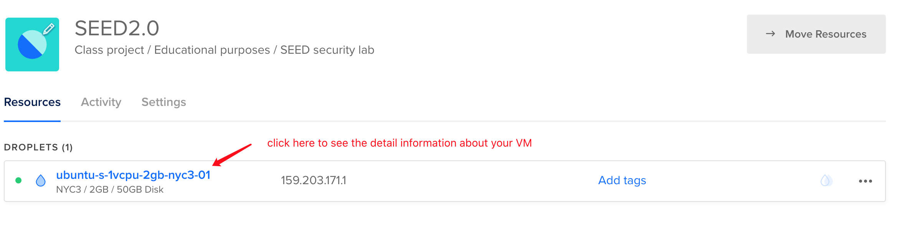

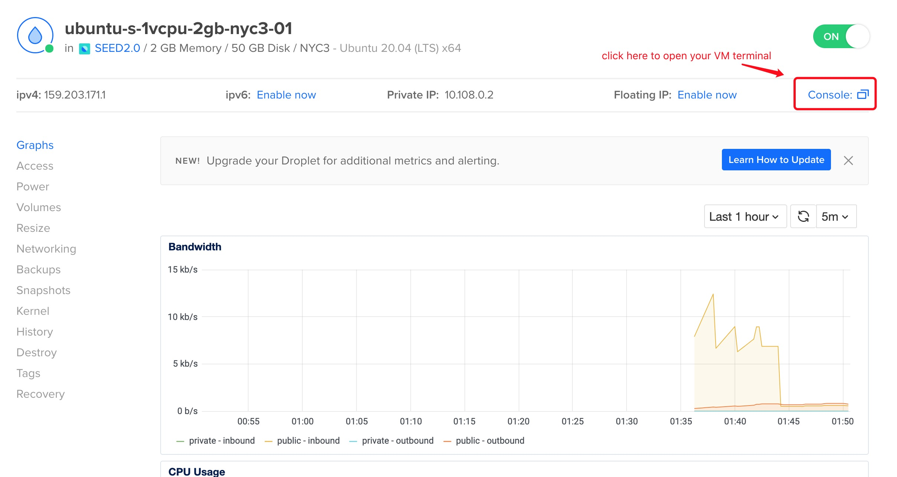

login the VM with root account, and enter the password you just set when you create
the droplet(VM). Note that when you are entering the password, the console will not response. Once you enter the correct password and press the ENTER key, you will login the VM successfully.

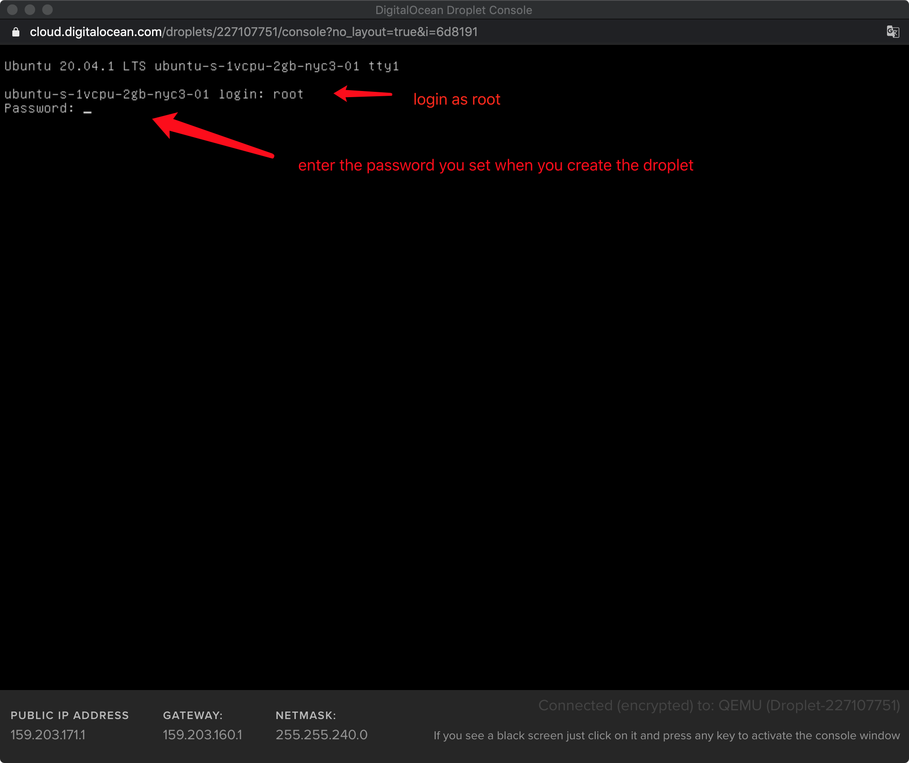

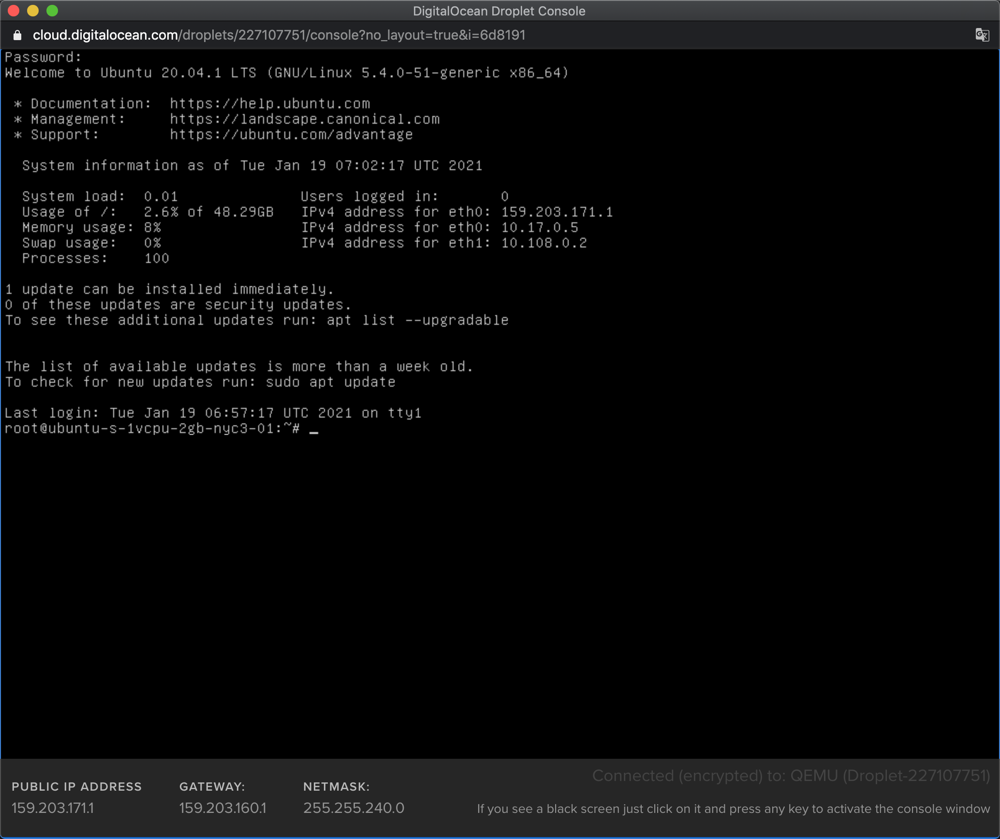

## NOTE: VNC issue

There is an issue you may met when you have configured the SEED lab environment. When you restart your VM, the DigitalOcean default browser-based SSH client will show as following:

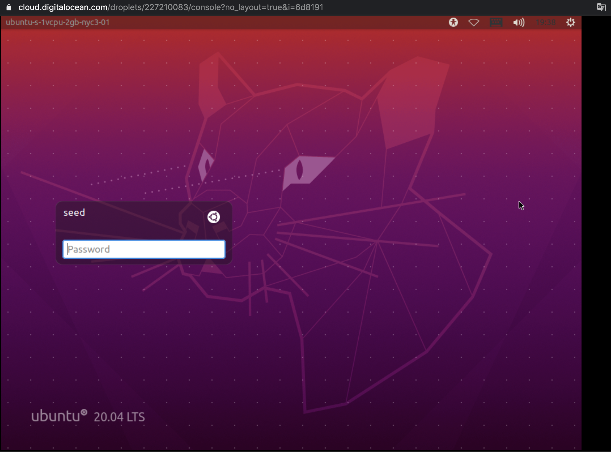

You can't directly log into the seed account because it doesn't have password. For some reason, there is distance between your mouse moving and server moving, so you also can't switch to the root account to log in. In this senario, you can't start the VNC server through the DigitalOcean default browser-based SSH client.

But you can still login root account by your local terminal.

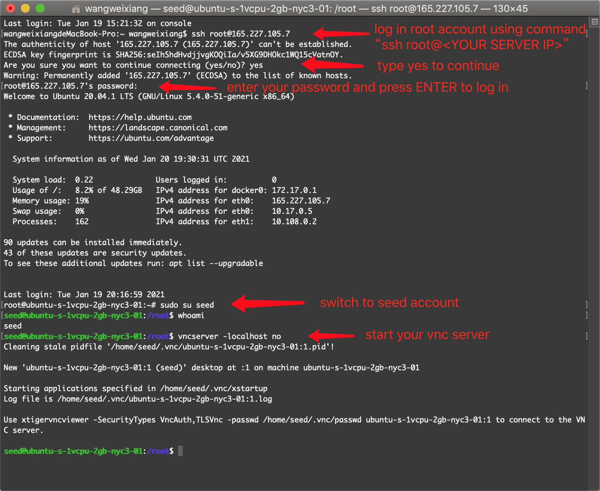
