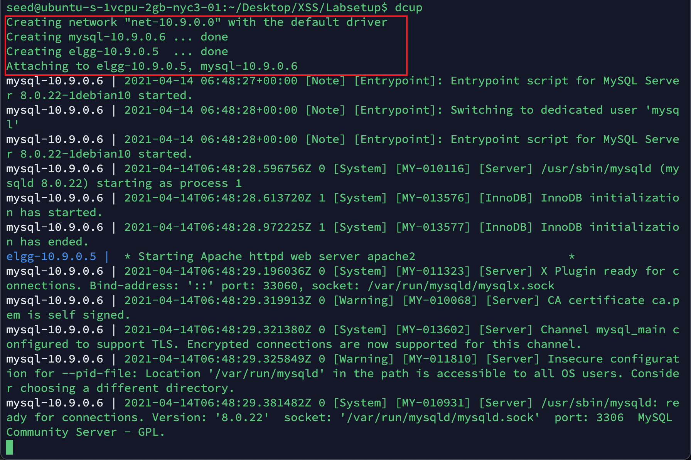
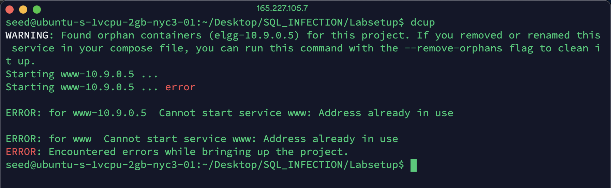
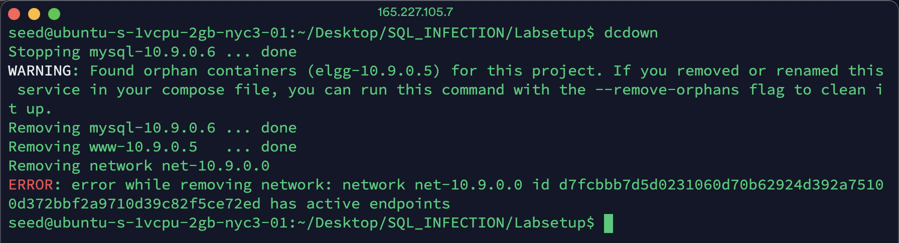
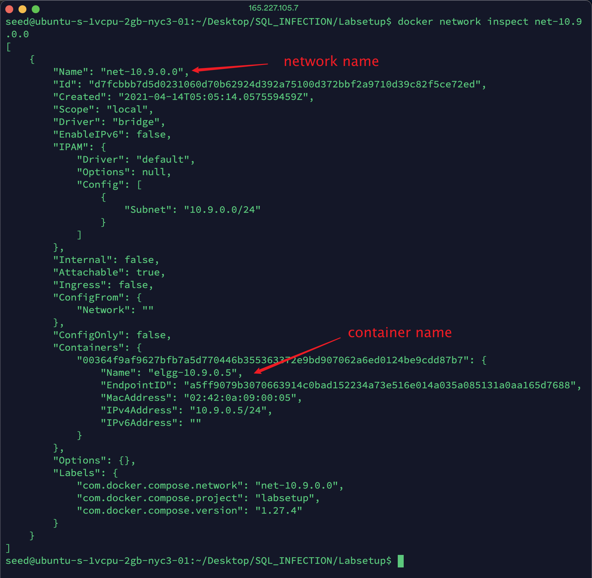
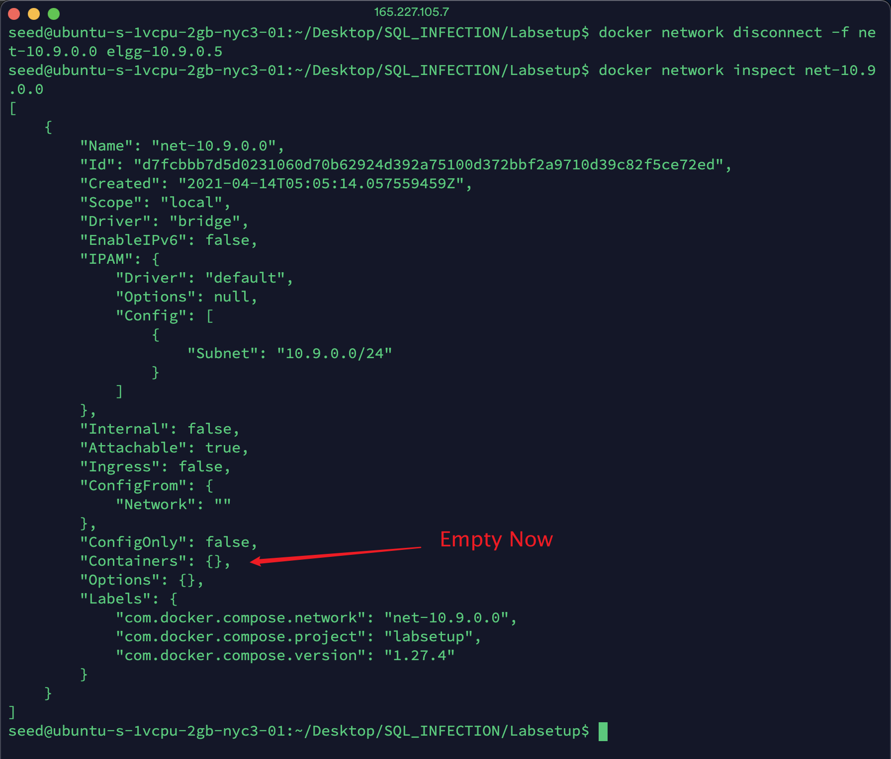
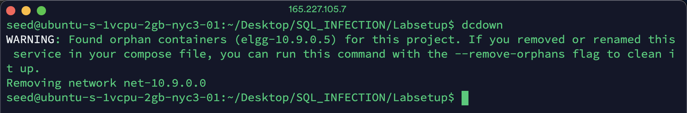
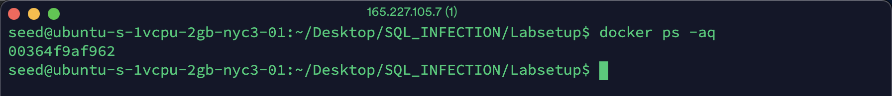
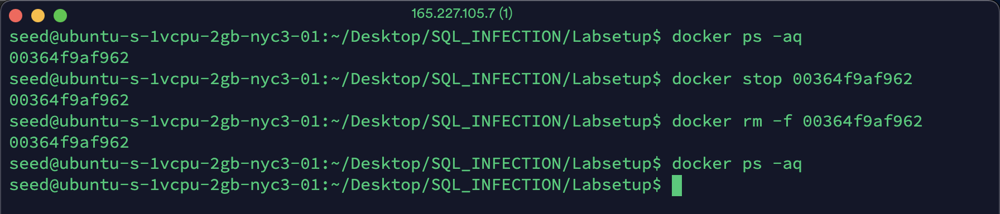
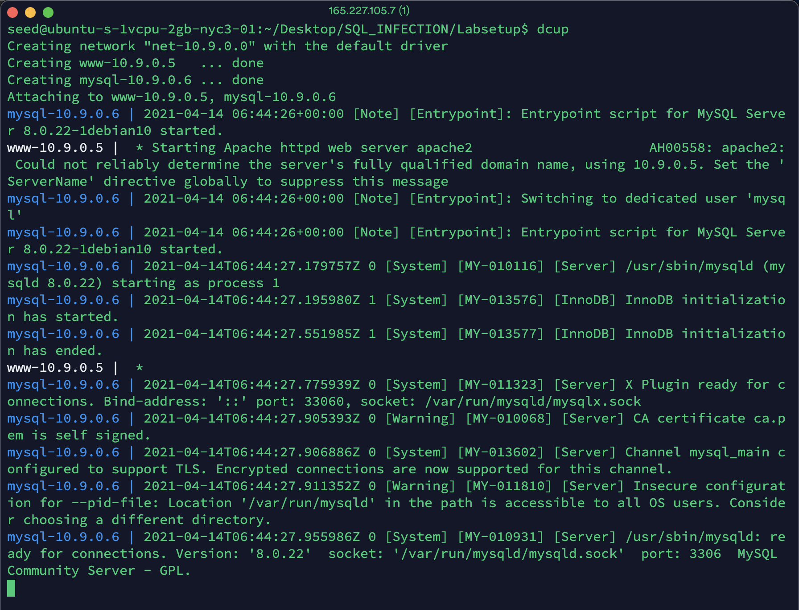

# My "docker-compose up" failed because I forgot to shut down the containers from another SEED lab

## Potential errors

Since most SEED labs use containers, if we forget to shut down
the containers used in the previous lab, and try to
use `dcup` (i.e `docker-compose up`) to start the containers in
the new lab, we will see errors.

For example, in my case, in the previous XSS lab, I have two containers
`elgg-10.9.0.5`, `mysql-10.9.0.6` and a network `net-10.9.0.0`.



I forget to use ```dcdown``` to shut down these containers before starting the SQL
injection lab. When I type ```dcup``` to start up the new containers
for SQL injection lab, an error message pops up, saying
"Cannot start service www: Address already in use".
That is because the address "10.9.0.5" is occupied by the XSS lab's containers.



Then I try to type the ```dcdown```, i.e. ```docker-compose down``` to shut
down the XSS lab's containers. Another error message shows "error while
removing network: .... active endpoints".



The reason behind is that the ```docker-compose up``` command messed up the
relationship between the containers and the network. It makes several containers orphan
containers, which cannot be removed properly by the ```dcdown``` command. Since
the network `net-10.9.0.0` is still connected by those orphan containers, it
cannot be removed. The solution is described in the following:

## Step 1: disconnect the network with containers

First you need to check the network information using ```docker network ls ```


Because we have already known the target network that we want to disconnect is
`net-10.9.0.0`, so we need to inspect which containers are connecting to this
network using ```docker network inspect ${NetworkName}```. In my case,
```${NetworkName}``` is "net-10.9.0.0".



You can find which containers are still connected to this network. In my case,
there is only one container called "elgg-10.9.0.5".

Then you need to use ```docker network disconnect -f ${NetworkName} ${ContainerName}```
to disconnect the network. In my case, ```${NetworkName}```
is `net-10.9.0.0` and ```${ContainerName}``` is `elgg-10.9.0.5`.



You can inspect the network again, and you will find that the container part is empty.
That means that you have disconnected it successfully.

NOTE: ```docker network disconnect -f ${NetworkName} ${ContainerName}```
only accept exactly two parameters, which means each time we can only disconnect one container.
If you need to disconnect several containers, you need to run it several times.

Once you have disconnected the network, you can remove the network properly using ```dcdown```




## Step 2: Remove the orphan containers

Based on the WARNING part or if you run ```dockps```, you will find there are
orphan containers. In my case, there is only one called "elgg-10.9.0.5"

You can use ```docker-compose up --remove-orphans``` to clean it up.
When you start up your new containers, the orphan containers will be automatically removed.

You can also manually clean these containers. This manual method can forcefully remove any container,
even if it is not an orphan.

You use ```docker ps -aq``` to check which container are still running. It will list the id of
the running containers.



Then you need to use ```docker stop ${ContainerID}``` to stop them first. ```${ContainerID}```
can include only the beginning part of the ID as long as it is unique.
In my case, even ```docker stop 0``` works well.


Now you can forcefully remove the container using ```docker rm -f ${ContainerID}```.
The result of this command is the ID of the stopped container.
You can use ```docker ps -aq``` again to make sure it has been removed.



NOTE: If you have several orphan containers you want to remove, you need to run these commands several times.
```
docker stop ${ContainerID}
docker rm -f ${ContainerID}
```

If you want to remove all the active container, you can run these command to stop and forcefully remove all the containers. Shell will run the command inside of ``` `` ``` first, i.e. ```docker ps -aq```, then replace the entire back quote with its standard output (including two back quotes). 

```
docker stop `docker ps -aq`
docker rm -f `docker ps -aq`
```

Now, you can ```dcup``` i.e. ```docker-compose up``` to start your container successfully!


