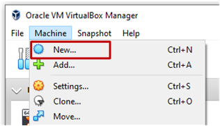
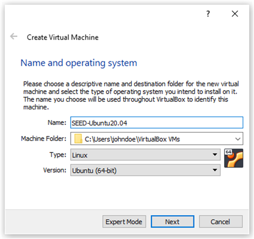
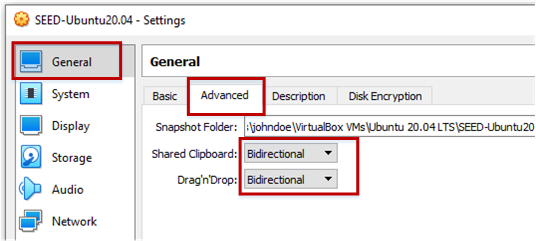
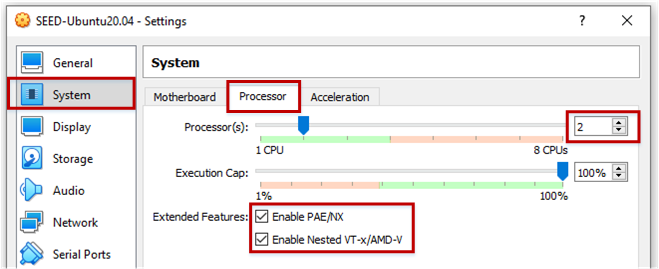
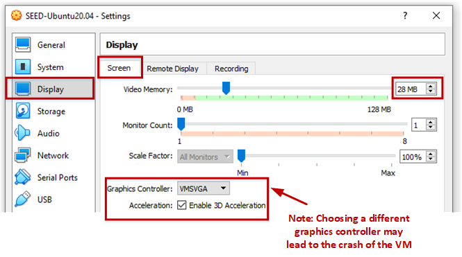
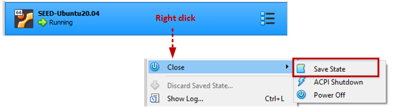

# Install SEED VM on VirtualBox

## Preparation 

Before installing the SEED VM, please do the following:

- Install the free VirtualBox software first. We recommend Version 6.1.10.
Please stay away from the newest versions, as they often have some issues
with our VM.

- Download the zip file `xyz.zip` from the SEED website, unzip it, 
and you will get a `.vdi` file. This file contains the pre-built SEED 
Ubuntu 20.04 image. This document shows how to create a virtual machine
using this image. 

## Step 1: Create a New VM in VirtualBox

## Step 2: Provide a Name and Select the OS Type and Version

Our prebuilt Ubuntu 20.04 VM is 64-bit, so pick Ubuntu (64-bit). 

## Step 3: Set the Memory Size

1024 MB should be sufficient, but we recommend 2GB. If your computer has more 
RAM, you can increase accordingly. The more memory you give to the VM, 
the better the performance you will get.

## Step 4: Select the Pre-built VM File Provided by Us

Click the folder image, th
Pick the `.vdi` file that you downloaded from the SEED website.  

## Step 5: Configure the VM

After the previous step, your VM will be created, and you will
see it on VirtualBox's VM panel. Right-click it, then click
the `Settings` option, and we need to do some post-installation 
configuration.

### Step 5.a: Enable Copy and Paste

Go to the `General` category, and select the `Advanced` tab. 
Select `Bidirectional` for both items. The first item allows users to copy
and paste between the VM and the host computer. The second item allows users
to transfer files between the VM and the host computer using Drag'n Drop (this 
feature is not always reliable).

### Step 5.b: CPUs 

Go to the `System` category, and select the `Processor` tab. 
Assign number of CPUs to this VM if you prefer. Although may be sufficient,
if the performance seems to be an issue, increase the number. 

### Step 5.b: Display

Go to the `Display` category, and select the `Processor` tab. If the 
display does not seem to work properly, try to increase the amount of video memory.
In our testing, `28 MB` seems to be sufficient. 

**Note 1**: Make sure to select `VMSVGA`, as choosing other graphic controllers 
may lead to the crash of the VM.

**Note 2**: If your computer's screen resolution is too high, the VM may not be able 
to match that resolution. As a result, your VM will look small on your screen. 
To make it looks bigger, adjust the `Scale Factor` in this setting. 

### Step 5.c: Network

Go to the `Network` category, and select the `Adapter 1` tab. We will
choose the `NAT Network` adaptor. Click the `Advanced` drop-down menu to
further configure the network adaptor.

## Start the VM and Take Snapshot (Optional)

We can now start the VM. You can also use the `Take` button to take a snapshot 
of your VM. This way, if something goes wrong, you can roll back the state of
your VM using the saved snapshots. 

## Stop the VM

There are many ways to stop the VM. The best way is to use the `Save State`. This
is different from shutting down the VM. It saves the current VM state, so next time
when you restart the VM, the state will be recovered. Moreover, the speed is also
faster than booting up a VM.

